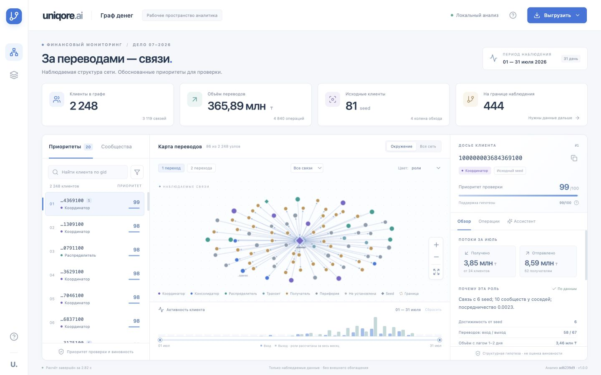
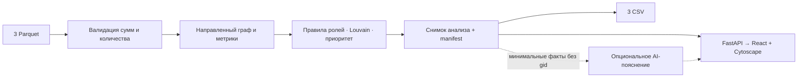

# Граф денег · Uniqore.ai

**Кого из 2 248 клиентов проверить первым — и на каком основании?**

Рабочее место AML-аналитика: очередь проверки, направленный граф переводов и досье клиента связаны одним выбором. Любая роль раскрывается до рассчитанных признаков, а связь — до исходных операций. Всё работает локально, без аккаунтов команды, GPU и обязательного AI-сервиса.



**Наше проверяемое отличие — явная граница знания.** В наборе 444 клиента находятся на четвёртом колене. Простое правило «нет исходящих → конечный получатель» пометило бы всех 444 как terminal. Здесь 441 получает `unknown`, ещё 3 — частичную гипотезу консолидации с поддержкой не выше 0,5. Досье объясняет причину и предлагает запросить продолжение цепочки. Это сравнение правил, **не измерение accuracy**: эталонных ролей нет.

| Реальный результат | Значение |
|---|---:|
| Клиенты / направленные связи / операции | 2 248 / 3 119 / 4 840 |
| Изолированные seed сохранены | 19 из 19 |
| Сообщества / приоритетные узлы | 88 / 20 |
| Оборот без потери копеек | 365 890 012,01 KZT |
| Первый процесс в новом Python-окружении | 27,00 с, включая импорты, расчёт, запись и проверку CSV |
| Пиковая память процесса | 197,16 MiB |

Измерение: macOS arm64, Python 3.12.1, зависимости из `requirements.lock`; установка не включена, кэш файлов ОС не очищался. Отдельный повтор в копии проекта — 7,59 с. [Метод и результаты](results/benchmark.json), [повтор](results/repeat-benchmark.json). Это измерения на одной машине, не гарантия для любого окружения.

## Запустить и проверить

Нужен **Python 3.12**. Node не нужен для просмотра: готовая сборка React включена в репозиторий. Команды выполнять из его корня. Первичная установка библиотек требует доступа к PyPI; дальнейший основной сценарий — без сети.

```bash
python3 -m venv .venv
source .venv/bin/activate
python -m pip install -r requirements.lock
```

После установки один запуск от исходных Parquet до CSV и интерфейса:

```bash
python -m moneygraph demo --data data --out out
```

Открыть **[http://127.0.0.1:8765](http://127.0.0.1:8765)**. Остановить сервер — `Ctrl+C`. Если порт занят, добавить `--port 8766`. Сервер по умолчанию слушает только локальный адрес. Внешней deployed-версии сейчас нет.

Только пересчёт или проверка сохранённых результатов:

```bash
python -m moneygraph run --data data --out out
python -m moneygraph verify --data data --out out
python -m moneygraph verify --data data --out results
python -m pytest -q
```

Проверенные артефакты доступны сразу: [роли всех узлов](results/nodes_roles.csv), [сообщества](results/clusters.csv), [топ-20](results/top_nodes.csv), [manifest с параметрами и SHA-256](results/manifest.json). Приложение каждый раз пересчитывает входные файлы, а не читает эти примеры вместо аналитики.

Проверка установки выполнена в отдельном виртуальном окружении и копии проекта. Windows/Linux в этой итерации не проверялись. В Windows активация окружения отличается: `.venv\Scripts\activate`.

## Сценарий аналитика за минуту

1. Выберите клиента в очереди или введите полный `gid` и нажмите Enter. Справа — его точная роль, поддержка гипотезы, приоритет, входящие/исходящие потоки и ограничения.
2. На графе выберите окружение в 1–2 перехода, направление или всю сеть. Цвет переключается между ролями и сообществами; seed — ромб, граница — пунктир.
3. Нажмите узел, чтобы открыть его досье; ребро — чтобы увидеть операции именно этой пары. Идентификатор источника `hash:row` указывает нулевой номер строки оригинального `transactions.parquet` и префикс его SHA-256.
4. Выберите дни на временной шкале или ползунками. Неактивные связи приглушаются, список операций меняется; роли и приоритеты остаются месячными, что явно подписано.
5. Откройте «Ассистент» для объяснения готовых фактов или «Выгрузить» для одного из трёх обязательных CSV.

Фильтры по роли, сообществу, seed и глубине действуют на очередь и граф. Если выбранный клиент скрыт фильтром, досье сохраняется и интерфейс предлагает сбросить фильтр. Поиск применяется к очереди; число узлов над графом относится к его текущему окружению.

Примеры для живого разбора, полученные из результата, а не заданные классификатору:

| `gid` | Что показать |
|---|---|
| `100000003684369100` | Первый в очереди: разные компоненты приоритета, неполный вход seed |
| `100000000031787100` | Транзитная гипотеза: вход и выход по 90 000 KZT, временная совместимость |
| `100000000456947100` | Изолированный seed: находится поиском, роль неизвестна, приоритет 0 |
| `100000000018102100` | Четвёртое колено: отсутствие выхода объясняется границей наблюдения |

[Сценарий пятиминутной демонстрации](docs/finance/demo.md) и [отчёт локальной проверки](docs/finance/validation.md).

## Как получается результат



Ядро — [moneygraph/analysis.py](moneygraph/analysis.py), API — [server.py](moneygraph/server.py), интерфейс — [frontend/src](frontend/src). API и экспорты привязаны к одному `analysis_id`; сервер держит неизменяемый результат в памяти. Даже перезапись каталога `out` другим запуском не подменяет CSV открытого сервера.

- Деньги суммируются в целых тиынах. Сумма и число операций каждой пары проверяются по `edges.parquet`.
- Все узлы добавляются из `nodes.parquet`, включая изоляты. 97 совпадающих строк операций сохранены: без transaction ID нет основания удалять их как повторы.
- Метрики: степени, суммы и количества, взвешенный PageRank, направленная невзвешенная betweenness, достижимость от других seed до четырёх переходов.
- Louvain: ненаправленная проекция с суммой весов обоих направлений, `seed=42`, `resolution=1`; номера сообществ упорядочены по минимальному gid, изоляты получают отдельные сообщества. Оборот кластера включает только внутренние направленные рёбра, каждое один раз.
- FIFO учитывает совместимый вход и последующий выход через 1–2 дня, без повторного использования объёма. Переводы одного дня не сопоставляются: порядок внутри дня неизвестен. Это совместимость, не доказанная трассировка денег.
- `gid` остаётся целым десятичным идентификатором в CSV и строкой в API/браузере. При открытии CSV в Excel импортируйте этот столбец как текст: значения превышают точность чисел JavaScript и Excel.

### Роли и поддержка гипотезы

Правила применяются сверху вниз. Пороги рассчитываются на входном наборе и записываются в manifest. `P75` — квантиль **положительных** степеней; `Q` — средний процентиль среди активных узлов, при нулевой метрике 0.

| Роль | Условие | `role_score` |
|---|---|---|
| `unknown` | Нет наблюдаемых связей | 0 |
| `coordinator` | Есть вход/выход; betweenness ≥ P90 положительных значений; соседи в ≥2 сообществах; достижим от ≥2 других seed | Среднее Q посредничества и достижимости |
| `consolidator` | Входящая степень ≥ max(3, ceil(P75)) и ≥2 × исходящая; на границе достаточно подтверждённой входящей степени | Среднее Q входящей степени и числа переводов; на границе максимум 0,5 |
| `distributor` | Исходящая степень ≥ max(10, ceil(P75)); для не-seed также ≥2 × входящая | Среднее Q исходящей степени и числа переводов |
| `transit` | Не seed; глубина <4; есть вход и выход; отношение сумм 0,8–1,2 | 0,6 × min(вход, выход)/max + 0,4 × сопоставленный объём/max |
| `terminal` | Есть вход, нет наблюдаемого выхода, глубина <4 | Среднее Q входящей суммы и числа переводов |
| `unknown` | Граница без достаточных признаков другой роли | 0 |
| `peripheral` | Остальные наблюдаемые узлы | 1 − max(Q степени, Q объёма, Q посредничества) |

В этой выборке пороги степеней — 3 и 10. `terminal` в интерфейсе называется «Получатель»: даже внутри границы это наблюдаемая структура, а не подтверждение удержания денег. `unknown` — документированное расширение словаря, разрешённое ТЗ.

`role_score` — некалиброванная поддержка структурной гипотезы, **не вероятность нарушения**. Правило `peripheral` — остаточное; у высокоактивного узла поддержка этой роли может быть низкой. Роль не исключает его из очереди.

### Приоритет проверки

```text
0,35 × Q(max(входящая сумма, исходящая сумма))
+ 0,25 × Q(betweenness)
+ 0,25 × Q(достижимость от других seed)
+ 0,15 × Q(число участий в переводах)
```

Изоляты имеют 0. Равные приоритеты после округления до 6 знаков упорядочиваются по gid. Коэффициенты — прозрачные начальные настройки без обучения на разметке. В досье раскрываются четыре слагаемых. `role_score` и `priority_score` независимы: отсутствие уверенной роли не означает низкий приоритет проверки.

### AI: только пояснения

Обязательные результаты вычисляются локальными алгоритмами. По умолчанию три вопроса ассистенту возвращают подписанные пояснения из рассчитанных фактов. Свободного чата и автономных действий в этой версии нет.

Опционально backend поддерживает совместимый с Chat Completions API провайдер. Перед запуском сервера задайте в окружении `LLM_BASE_URL` (с базовым `/v1` при необходимости), `LLM_MODEL`, `LLM_API_KEY`. Имена приведены в [.env.example](.env.example); файл `.env` автоматически не загружается. Ключ не передаётся браузеру и не входит в Git.

Провайдер получает только три коротких текста с метриками, ограничениями и псевдонимом «Клиент A», без исходных gid и транзакций. Ответ должен ссылаться на существующие ключи доказательств. Ошибка, неверный JSON или тайм-аут 15 секунд возвращают локальное объяснение. Внешний ответ не меняет роли, приоритеты и CSV; проверка ссылок не гарантирует истинность каждой фразы. Живой внешний API в этой версии не проверялся: контракт и отказы проверены имитацией ответов в тестах.

## Данные, технологии и разработка

[Три исходных Parquet](data/) предоставлены для этого кейса; SHA-256 зафиксированы в manifest. Данные обезличены и предназначены исключительно для хакатона. Никакого внешнего обогащения или вымышленных атрибутов нет. [ТЗ и исходное описание](docs/finance/README.md).

Проверенные версии: Python 3.12.1, FastAPI 0.141.1, pandas 2.3.3, PyArrow 24.0.0, NumPy 2.5.3, NetworkX 3.7. Полный Python-набор — `requirements.lock`, frontend — `frontend/package-lock.json`. React + TypeScript + Vite + Cytoscape; системные шрифты и локальные ассеты, без CDN.

Изменение интерфейса (Node 22.12+; фактически проверен Node 25.8.1):

```bash
cd frontend
npm ci
npm run dev
# в другом терминале запускается Python demo на 8765;
# Vite выводит адрес разработки и перенаправляет /api на backend
npm run format:check
npm run build
```

Сборка сохраняется в `moneygraph/web/` и коммитится вместе с исходниками. Рабочие изменения выполняются в **отдельной ветке каждой задачи → локальная проверка → PR в main**. Постоянной ветки dev нет. Слияние требует подтверждения локальной приёмки; [правила](docs/development-workflow.md).

## Ограничения и следующий масштаб

Один банк, июль 2026, исходящий обход на четыре колена и суммы от 5 000 KZT. Внешние входы, остатки и продолжение границы неизвестны. Нет эталонных ролей, поэтому accuracy, recall и доказанная эффективность расследования не заявляются. Сообщества не равны преступным группам; все назначения — гипотезы.

Сейчас реализованы роли, кластеры, приоритет, временная совместимость, досье, фильтры и объяснения. Отдельные детекторы циклов, дробления, стресс-тест удаления top-N и свободный AI-чат отложены. Интерфейс предназначен прежде всего для ноутбука; на узком экране панели идут вертикально.

**При росте до миллиона узлов:** агрегировать Parquet пакетами через DuckDB/Polars; заменить Python-объекты компактным графом и вынести расчёт в отдельный процесс; считать приближённую betweenness на выборке и ограниченные локальные признаки; использовать Leiden/Louvain в igraph; хранить снимки и индексировать gid; выдавать в браузер только окружение, серверные фильтры и агрегаты. Сохранить версионирование правил и контроль сумм. Проверять время, память, стабильность top и роль границы на отдельном нагрузочном наборе. Такой масштаб **не реализован и не измерен**.

[Архитектурный план](docs/finance/architecture.md) · [Фактическая реализация](docs/finance/implementation.md) · [Проверка по критериям](docs/finance/validation.md).

[Документация проекта](docs/README.md) · [Agentic SDD pipeline: план разработки через Codex и Claude Code](docs/agentic-sdd-pipeline/README.md).
