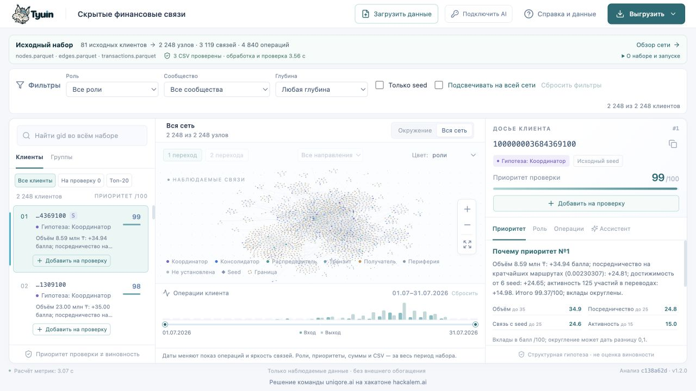
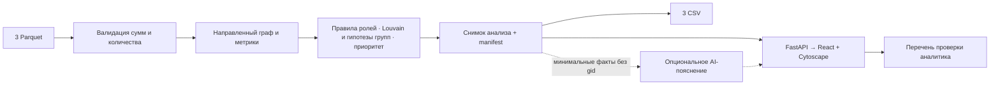

# Tyuin · Скрытые финансовые связи

**[Открыть приложение — hackalemai.uniqore.dev](https://hackalemai.uniqore.dev)**


**От потока переводов — к понятной картине связей и обоснованному плану проверки.**

Tyuin — рабочее пространство для исследования финансовых связей. Оно помогает аналитику увидеть движение средств между участниками, разобраться в структуре групп и определить, кого проверить первым. Можно исследовать демонстрационный набор или загрузить свои три Parquet в поддерживаемом формате.

Направленный граф, список клиентов и досье связаны между собой. От общей картины можно перейти к отдельному участнику, основаниям его роли и конкретным операциям. Приоритет проверки сопровождается объяснением.

**Понимать, где заканчиваются данные, так же важно, как видеть связи.** Tyuin учитывает границы наблюдения, показывает неопределённость и помогает определить следующий шаг проверки.

Основная аналитика работает локально, без GPU и внешнего AI. Ассистент дополняет её объяснениями рассчитанных фактов. Основной пользователь — аналитик финансового мониторинга; текущий набор демонстрирует подход на задаче исследования транзакционной сети.

[Запуск и деплой](#запустить-и-проверить) · [Свои данные](#загрузить-собственные-данные) · [Сценарий аналитика](#проверить-сценарий-аналитика) · [Как работает](#как-получается-результат) · [Результаты](#демонстрация-на-данных-хакатона) · [Ограничения и развитие](#ограничения-и-следующий-масштаб)



## Запустить и проверить

Онлайн-приложение доступно по **[https://hackalemai.uniqore.dev](https://hackalemai.uniqore.dev)** без аккаунта Brev. Ниже — самостоятельный запуск и полный путь развёртывания на своём сервере. Основной сценарий, API и три CSV не требуют ключа AI.

23.09.2026 приложение обновлено до `main` `f4077ff`: алгоритм 1.2.0, импорт собственных Parquet, новый интерфейс и подключение AI из браузера. На Brev прошли 127 тестов, проверки API, трёх CSV и импорта через HTTPS. [Отчёт передеплоя и откат](docs/deployment/brev-redeploy-f4077ff.md).

Имя продукта — **Tyuin**; внутренний Python-пакет и CLI называются `moneygraph`. «Граф денег» — название демонстрационного кейса организатора.

### Подготовка

Выберите один способ запуска:

| Способ | Что установить | Что входит в репозиторий |
|---|---|---|
| Docker | Git, работающий Docker Engine / Docker Desktop и Compose v2 с поддержкой `--wait` | Python, зависимости, frontend и данные собираются в образ |
| Python | Git и Python 3.12+; версия 3.14.1 исключена NetworkX 3.7 | Готовый frontend, `requirements.lock`, исходные Parquet |
| Brev VM | Brev CLI, доступ к своей VM; на VM — Docker и Compose | Тот же Dockerfile и Compose, конфигурация HTTPS |

Для воспроизведения полного исторического Windows-прогона используйте Python 3.12.14. Node нужен только для разработки интерфейса. Первичная установка Python-зависимостей требует PyPI, сборка Docker — также Docker Hub. После установки основной локальный сценарий работает без сети.

Склонируйте репозиторий и перейдите в его корень:

```bash
git clone https://github.com/BAITC-Hacks/hack-9fee8947-uniqore-ai.git
cd hack-9fee8947-uniqore-ai
```

В checkout должны быть `requirements.lock`, `moneygraph/web/` и три файла `data/nodes.parquet`, `data/edges.parquet`, `data/transactions.parquet`. Вручную готовить CSV или собирать frontend для просмотра не нужно. Если репозиторий закрыт, используйте свою разрешённую Git-авторизацию без токена в URL.

### Docker: сборка и запуск

Команды выполняются из корня репозитория в PowerShell или Bash:

```bash
docker compose version
docker compose --env-file .env.example config --quiet
docker compose --env-file .env.example up -d --build --wait --wait-timeout 360
docker compose --env-file .env.example ps
docker compose --env-file .env.example exec -T app python -m moneygraph verify --data /app/data --out /app/out
```

Ожидаемый результат: сервис `app` имеет статус `healthy`, `verify` возвращает `status: "ok"`. Откройте **[http://127.0.0.1:8765](http://127.0.0.1:8765)** и проверьте клиентов, граф и досье. Адрес `0.0.0.0` в логе относится к контейнеру; в браузере используйте `127.0.0.1`.

Порт по умолчанию открыт только на loopback. Если 8765 занят, задайте `TYUIN_PORT=8766` перед запуском: в Bash — `export TYUIN_PORT=8766`, в PowerShell — `$env:TYUIN_PORT = '8766'`. Тогда адрес приложения — `http://127.0.0.1:8766`.

Логи, перезапуск и остановка:

```bash
docker compose --env-file .env.example logs --tail=100 app
docker compose --env-file .env.example restart app
docker compose --env-file .env.example up -d --wait --wait-timeout 360
docker compose --env-file .env.example down
```

Каждый старт пересчитывает данные. Результаты находятся в именованном томе `analysis-output`; `down` сохраняет его, `down --volumes` удаляет. Контейнер работает от UID/GID 10001: произвольный bind mount вместо `/app/out` требует соответствующих прав. Лимит 360 секунд относится к ожиданию готовности после сборки, а не к общей длительности установки.

### Windows: PowerShell и Python

Установите Python 3.12 и проверьте выбранный интерпретатор. Выполните из корня репозитория:

```powershell
py --list
py -3.12 --version
py -3.12 -m venv .venv
.\.venv\Scripts\python.exe -m pip install -r requirements.lock
.\.venv\Scripts\python.exe -m pip check
.\.venv\Scripts\python.exe scripts/check_environment.py --profile runtime
.\.venv\Scripts\python.exe -m moneygraph demo --data data --out out
```

Ожидаются `No broken requirements found`, `PASS`, затем JSON `status: "ok"` и адрес сервера. Активация окружения и изменение `ExecutionPolicy` не нужны. Без launcher используйте полный путь к Python: например, `& 'C:\Python312\python.exe' -m venv .venv`, заменив путь своим. Для другого поддерживаемого интерпретатора укажите его версию явно, например `py -3.14`, исключая 3.14.1. Существующее окружение другой версии сохраните и создайте новое.

### macOS / Linux: Python

Проверьте `python3 --version`. Если он старше 3.12 или равен 3.14.1, выберите поддерживаемый интерпретатор, например `python3.12`, в первой команде:

```bash
python3 -m venv .venv
source .venv/bin/activate
python -m pip install -r requirements.lock
python -m pip check
python scripts/check_environment.py --profile runtime
python -m moneygraph demo --data data --out out
```

Для обоих Python-маршрутов откройте **[http://127.0.0.1:8765](http://127.0.0.1:8765)** после появления адреса в терминале. Сервер слушает только локальный адрес; терминал должен оставаться открытым. Остановить — `Ctrl+C`. При занятом порте добавьте `--port 8766` и откройте адрес с этим портом. Повторный расчёт перезаписывает выбранный `--out`; не используйте `results/` как выходной каталог.

### Проверить успешный запуск

В другом терминале проверьте API. Bash:

```bash
curl --fail --max-time 10 http://127.0.0.1:8765/api/health
```

PowerShell:

```powershell
Invoke-RestMethod http://127.0.0.1:8765/api/health
```

Ответ должен содержать `status: ok` и тот же `analysis_id`, что `out/manifest.json` (для Docker — `/app/out/manifest.json`). При изменении порта подставьте свой. Проверка API не заменяет проверку интерфейса:

1. Откройте приложение: видны клиенты, направленный граф и досье.
2. Найдите `100000000018102100`: досье показывает четвёртое колено и недостаточность данных для роли.
3. Выберите связь на графе и проверьте список её операций.
4. Через «Выгрузить» скачайте три CSV; выполните `verify` для выходного каталога.

### NVIDIA Brev: развёртывание на VM

Создайте свою VM в [Brev Console](https://brev.nvidia.com/) в **VM Mode**, без Jupyter. Для приложения достаточно CPU; GPU не используется. На VM должны работать Docker и Compose. На своём компьютере установите [Brev CLI](https://docs.nvidia.com/brev/cli/getting-started); на Windows используйте Bash внутри WSL с Ubuntu 20.04+.

В локальном терминале Bash/WSL:

```bash
brev --version
brev login
brev refresh
brev ls --json
brev shell tyuin
```

Здесь `tyuin` — имя вашего инстанса; замените его при необходимости. Перед подключением дождитесь `BUILD COMPLETED`, `SHELL READY`, `HEALTH HEALTHY`. Для VM используется обычный SSH-шлюз Brev. В контейнерном режиме для Docker хоста может потребоваться `--host`; для проверенной VM обычное подключение работает, а `--host` получало тайм-аут.

На VM клонируйте репозиторий командами из раздела «Подготовка» и выберите проверенный commit: `git checkout <SHA_проверенной_версии>`. Он должен содержать Dockerfile, готовый frontend и `deploy/brev/domain-web.compose.yml`. Затем выполните:

```bash
docker compose version
docker compose --env-file .env.example config --quiet
docker compose --env-file .env.example up -d --build --wait --wait-timeout 360
docker compose --env-file .env.example ps
curl --fail --max-time 10 http://127.0.0.1:8765/api/health
docker compose --env-file .env.example exec -T app python -m moneygraph verify --data /app/data --out /app/out
```

Для закрытого репозитория можно доставить архив проверенного commit без GitHub-токена на VM. На своём компьютере из чистого checkout выбранной версии:

```bash
git archive --format=tar.gz --output=../tyuin-release.tar.gz HEAD \
  Dockerfile docker-compose.yml .dockerignore .env.example requirements.lock \
  moneygraph data deploy scripts tests results
shasum -a 256 ../tyuin-release.tar.gz
scp ../tyuin-release.tar.gz tyuin:~/tyuin-release.tar.gz
```

На VM выполните `sha256sum ~/tyuin-release.tar.gz` и сравните с локальной суммой. При несовпадении остановитесь. Распакуйте архив в **новый каталог** выбранного выпуска и выполните команды Compose выше:

```bash
mkdir -p ~/workspace/tyuin-release
cd ~/workspace/tyuin-release
tar -xzf ~/tyuin-release.tar.gz
```

Для повторного выпуска задайте новое имя каталога. Архив содержит демонстрационные данные: передавайте его только на разрешённую VM. Рабочий `.env`, `.git` и персональные ключи в архив не входят. При первоначальном облачном прогоне использована именно доставка архива; [подробный отчёт](docs/deployment/brev.md#проверка-на-brev).

Для доступа без публичного домена на своём компьютере откройте туннель и оставьте его работающим:

```bash
brev refresh
brev port-forward tyuin --port 18765:8765
```

Откройте **[http://127.0.0.1:18765](http://127.0.0.1:18765)**. Эквивалент через настроенный SSH-шлюз: `ssh -N -T -o ExitOnForwardFailure=yes -L 127.0.0.1:18765:127.0.0.1:8765 tyuin`. После закрытия терминала или перезагрузки компьютера туннель нужно открыть снова.

### Собственный домен и HTTPS

Этот вариант рассчитан на **Linux VM** с уже работающим приложением на `127.0.0.1:8765`. Посетителям публичного домена не нужен аккаунт Brev. Собственной авторизации у Tyuin нет: публикуйте только разрешённые для такого доступа данные. Демонстрационный адрес проекта — [hackalemai.uniqore.dev](https://hackalemai.uniqore.dev).

1. В DNS своего домена создайте A-запись на текущий публичный IPv4 вашей VM. Проверьте, что она разрешается; не оставляйте AAAA на другой сервер. При наличии ограничивающих CAA разрешите выпуск сертификата Let's Encrypt.
2. Убедитесь, что входящие TCP 80/443 доступны в настройках провайдера и firewall VM, а сами порты свободны. Не открывайте наружу 8765 или административный API Caddy 2019.
3. Из корня выбранного выпуска на VM задайте свой домен **без схемы и пути** и проверьте конфигурацию:

```bash
export TYUIN_DOMAIN=tyuin.example.com

docker compose --env-file .env.example \
  -f docker-compose.yml -f deploy/brev/domain-web.compose.yml config --quiet
docker compose --env-file .env.example \
  -f docker-compose.yml -f deploy/brev/domain-web.compose.yml \
  run --rm --no-deps domain-web caddy validate --config /etc/caddy/Caddyfile --adapter caddyfile
```

`tyuin.example.com` — пример, замените его своим DNS-именем. Если на Ubuntu включён UFW, разрешите HTTP/HTTPS (SSH-доступ должен оставаться разрешённым):

```bash
sudo ufw allow proto tcp from any to any port 80 comment tyuin-domain-http
sudo ufw allow proto tcp from any to any port 443 comment tyuin-domain-https
```

Запустите Caddy и проверьте внешний доступ. Первоначальный выпуск сертификата может занять время: если первый запрос ещё не проходит, дождитесь успешного выпуска по `logs --tail=100 domain-web` с теми же Compose-файлами и повторите проверку. При устойчивой ошибке проверьте DNS и входящие порты:

```bash
docker compose --env-file .env.example \
  -f docker-compose.yml -f deploy/brev/domain-web.compose.yml up -d --no-deps domain-web
curl --fail --max-time 10 "https://${TYUIN_DOMAIN}/api/health"
curl --head --max-time 10 "http://${TYUIN_DOMAIN}/"
```

Ожидаются `status: ok`, доверенный HTTPS-сертификат и перенаправление HTTP на HTTPS (308). Затем в браузере откройте `https://` со своим доменом и повторите поиск клиента и выгрузку трёх CSV. Не используйте `--insecure`: доверие сертификату — часть проверки.

Caddy получает и продлевает сертификат автоматически; тома `caddy-data` и `caddy-config` нужно сохранять. `--no-deps` выше запускает только прокси и предполагает уже здоровый `app`. При изменении порта приложения задайте тот же `TYUIN_PORT` для прокси. Переменные `TYUIN_DOMAIN` и `TYUIN_PORT` нужно задавать снова при пересоздании контейнеров. Linux host networking из этого Compose не предназначен для обычного локального Docker-запуска на macOS/Windows.

### Обновление, откат и обслуживание

Сохраняйте предыдущий каталог и образ, а каждому новому выпуску задавайте отдельный тег по проверенному commit. В командах ниже замените `COMMIT_SHA` на SHA нового выпуска; он известен и при доставке архива без `.git`.

Сначала в каталоге работающего выпуска на VM сохраните **образ действующего контейнера**, независимо от того, какой тег использовался раньше:

```bash
export TYUIN_RELEASE=COMMIT_SHA
TYUIN_OLD_CONTAINER=$(docker compose -p tyuin --env-file .env.example ps -q app)
TYUIN_OLD_IMAGE=$(docker inspect --format '{{.Image}}' "$TYUIN_OLD_CONTAINER")
docker tag "$TYUIN_OLD_IMAGE" "tyuin:rollback-${TYUIN_RELEASE}"
```

Если контейнер не найден или команда завершилась ошибкой, остановитесь. Не перезаписывайте существующий rollback-тег: для повторной попытки используйте отдельную метку. Перейдите в новый каталог выбранного выпуска и явно задайте новый тег, даже если в этом терминале раньше выполнялся откат:

```bash
export TYUIN_IMAGE="tyuin:${TYUIN_RELEASE}"
docker compose -p tyuin --env-file .env.example build app
docker compose -p tyuin --env-file .env.example \
  up -d --no-deps --no-build --wait --wait-timeout 360 app
docker compose -p tyuin --env-file .env.example exec -T app \
  python -m moneygraph verify --data /app/data --out /app/out
```

Затем проверьте публичный health, поиск, подпись интерфейса и три CSV. Команда заменяет только `app`; Caddy и его тома сохраняются. При запуске выполняется пересчёт, поэтому возможен короткий перерыв до готовности API. Для обновления не используйте `down`, `--remove-orphans` или `--volumes`.

Если проверка не прошла, перейдите в сохранённый предыдущий каталог и верните закреплённый образ:

```bash
export TYUIN_IMAGE="tyuin:rollback-${TYUIN_RELEASE}"
docker compose -p tyuin --env-file .env.example \
  up -d --no-deps --no-build --wait --wait-timeout 360 app
```

Повторите health и `verify`. Предыдущий код пересчитает результаты в том же томе. Не удаляйте старый каталог: он нужен для отката, а его `deploy/brev/caddy` может оставаться источником конфигурации работающего прокси.

Для конфигурации домена все команды выполняйте с теми же `TYUIN_DOMAIN`, `TYUIN_PORT` и двумя Compose-файлами. Логи прокси:

```bash
docker compose --env-file .env.example \
  -f docker-compose.yml -f deploy/brev/domain-web.compose.yml logs --tail=100 domain-web
```

После изменения Caddyfile примените его без остановки приложения:

```bash
docker compose --env-file .env.example \
  -f docker-compose.yml -f deploy/brev/domain-web.compose.yml \
  exec -T domain-web caddy reload --config /etc/caddy/Caddyfile --adapter caddyfile
```

Чтобы остановить только HTTPS, используйте ту же команду Compose с `stop domain-web`; возобновить — `up -d --no-deps domain-web`. Не удаляйте тома сертификатов при обновлении. Если меняете каталог выпуска, пересоздайте прокси из нового каталога после проверки приложения, сохранив имя Compose-проекта `tyuin` и его тома.

Остановка контейнеров не останавливает VM. Для завершения работы VM используйте `brev stop tyuin` или Brev Console; сайт станет недоступен. После повторного запуска проверьте публичный IP и DNS. Docker restart policy не включает остановленную VM. История проверок и нюансы эксплуатации — в [инструкции Brev](docs/deployment/brev.md).

### Альтернативный запуск готового образа в Brev

Для режима Docker Compose / Launchable используйте `deploy/brev/docker-compose.yml`. Нужен опубликованный образ для Linux amd64, доступный вашей VM; готовый публичный образ проекта не предоставляется.

На машине с Docker Buildx в Bash, после авторизации в разрешённом реестре:

```bash
export TYUIN_IMAGE="ghcr.io/YOUR_ORG/tyuin:$(git rev-parse --short=12 HEAD)"
docker buildx build --platform linux/amd64 --tag "$TYUIN_IMAGE" --push .
docker compose -f deploy/brev/docker-compose.yml config --quiet
```

Замените `YOUR_ORG` на свой namespace в нижнем регистре. `--push` публикует образ вместе с данными кейса: реестр и доступ должны соответствовать разрешённому использованию данных. Для закрытого реестра предварительно настройте pull-доступ на VM.

В Brev выберите Docker Compose, загрузите указанный файл, задайте Source «My code files are embedded in my container(s)», выключите Jupyter и добавьте обязательный Text-параметр `TYUIN_IMAGE` с опубликованным тегом или digest. Для доступа используйте Secure Link на порт 8765 и View access «Only my organization». Прямые API-проверки выполняйте через SSH-туннель. Не открывайте сырой порт приложения всему интернету. Реальная публикация образа в реестр и Secure Link этим проектом пока не проверены; основной проверенный маршрут — VM с Docker и собственным HTTPS-доменом.

### Пересчёт, CSV и автоматическая проверка

Для Python-запуска в PowerShell замените `python` на `.\.venv\Scripts\python.exe`; в macOS/Linux используйте активированное окружение:

```bash
python -m moneygraph run --data data --out out
python -m moneygraph verify --data data --out out
python -m moneygraph verify --data data --out results
python -m pytest -q
```

`run` пересчитывает и проверяет результат без HTTP-сервера. В `out/` появляются три CSV, `manifest.json` и `analysis.json`; `results/` хранит проверенные примеры и не используется как выходной каталог. Успешный `verify` возвращает `status: ok` и код 0. В PowerShell код последней команды — `$LASTEXITCODE`.

[Роли всех узлов](results/nodes_roles.csv) · [Сообщества](results/clusters.csv) · [Топ-20](results/top_nodes.csv) · [Manifest и SHA-256](results/manifest.json).

Автоматическая проверка CLI, API, локальных assets и CSV без Node и AI-ключа:

```bash
python scripts/smoke_local_launch.py --data data --out out/readme-check --port 8876
```

Нужны чистый Git checkout и **новый** каталог `out/readme-check`. Для повтора выберите другое имя. Успех — `status: pass`, код 0 и отчёт `out/readme-check/smoke-report.json`. Скрипт завершает только свой сервер. Preflight проверяет окружение, smoke — расчёт и HTTP; граф, поиск и остановку через Ctrl+C дополнительно проверьте в браузере и терминале.

### Если запуск не удался

| Симптом | Действие |
|---|---|
| Python не найден или версия не подходит | Проверьте выбранный интерпретатор: нужен 3.12+, кроме 3.14.1. Создайте новый venv нужной версией. |
| `VENV_REQUIRED` / `VENV_ISOLATION` | Используйте Python из нового venv без `--system-site-packages`. |
| Ошибка зависимости или `pip check` | Установите `requirements.lock` тем же Python из venv; проверьте доступ к PyPI. Не меняйте lock ради обхода ошибки. |
| `INPUT_MISSING_OR_INVALID` | Проверьте три Parquet в `data/` и целостность checkout. CSV не заменяют входные данные. |
| `FRONTEND_MISSING`, пустая страница | Проверьте `moneygraph/web/` из той же версии, сетевые запросы и консоль браузера. |
| Порт занят | Выберите другой порт; не завершайте чужой процесс. |
| Docker недоступен или не знает `--wait` | Запустите Docker Engine / Desktop, проверьте версию Compose. Проверялся Compose 2.24.5 и новее. |
| Контейнер не стал `healthy` | Посмотрите `logs --tail=100 app`, проверьте данные и права тома. Статус `unhealthy` сам по себе не вызывает restart. |
| `verify --out results` сообщает несовпадение hash | Используйте свежий checkout с `.gitattributes`; не пересохраняйте эталонные CSV и manifest. |
| Smoke сообщает, что output существует | Выберите новый каталог внутри `out/`, сохранив предыдущий результат. |
| `brev ... --host` получает тайм-аут | Для VM Mode попробуйте обычный SSH-шлюз: `brev refresh`, затем `brev shell tyuin`. |
| Домен не открывается или сертификат не выдан | Проверьте текущий IP, A/AAAA/CAA, доступность 80/443, занятость портов и логи `domain-web`. |
| После остановки VM сайт недоступен | Запустите VM, проверьте IP и DNS, затем состояние приложения и Caddy. |
| Русский текст искажается в терминале | Используйте UTF-8; не пересохраняйте CSV ради отображения. |

[Дополнительная диагностика Windows](docs/local-launch.md) · [Подробности Brev и сохранённые проверки](docs/deployment/brev.md).

AI подключается отдельно в интерфейсе и не является условием запуска. [Настройка и границы AI](#ai-пояснения-и-чат-по-выбранному-клиенту).

## Загрузить собственные данные

После запуска откройте **«Загрузить данные»**, выберите `nodes.parquet`, `edges.parquet` и `transactions.parquet`, затем запустите обработку. Имена, поля и типы должны соответствовать [схеме входа](docs/specs/custom-data-upload.md#контракт-входа); дополнительные колонки не принимаются. Нужны обезличенные данные с той же семантикой, что у кейса: seed и исходящие связи до четвёртого колена, KZT, операции от 5 000 ₸. Период берётся из дат операций и может отличаться от июля 2026; максимум 366 календарных дней включительно.

| Файл | Поля |
|---|---|
| `nodes.parquet` | `gid` int64, `depth` целое 0–4, `is_seed` bool |
| `edges.parquet` | `src`, `dst` int64; `sum_kzt` число; `n_tx` положительное целое; `depth` целое 1–4 |
| `transactions.parquet` | `src`, `dst` int64; `date` календарная дата без часового пояса; `sum_kzt` число |

Нужны непустой набор клиентов и хотя бы одна операция. `gid` уникален в `nodes`, `is_seed` соответствует `depth=0`. Пары в `edges` уникальны; их суммы в тиынах и число операций должны точно совпадать с `transactions`. Глубина 4 остаётся границей наблюдения, а не параметром, вычисляемым из максимальной глубины загруженного графа.

Лимиты браузерного импорта: **10 MiB на файл, 30 MiB на весь запрос вместе со служебными полями**, 5 000 клиентов, 20 000 связей и 100 000 операций; распакованный объём каждого Parquet ограничен 64 MiB. Сервер проверяет формат, типы, ссылки на клиентов, уникальность пар, суммы и количество операций; затем считает анализ и проверяет три CSV. Граф, досье, группы и скачиваемые CSV относятся к одному набору. При ошибке текущий анализ сохраняется. При успешном переключении старые фильтры, перечень проверки, чат и ключ AI сбрасываются. Для набора меньше 20 клиентов top содержит всех клиентов.

Импорт передаётся серверу Tyuin: при локальном запуске — вашему компьютеру, при удалённом — тому серверу, где работает приложение. Временные исходные файлы удаляются после обработки. Результат доступен до часа, очищается из памяти с интервалом до 30 секунд и теряется при перезапуске сервера; это не постоянное хранилище. Токен результата сохраняется в `sessionStorage` текущей вкладки и не включается в URL; перезагрузка вкладки сохраняет импорт до истечения срока. «Вернуться к исходному набору» освобождает текущий импорт; другие вкладки с собственными наборами не переключаются. Набор, указанный при запуске через `--data`, остаётся доступен. В одном серверном процессе одновременно разрешены один импортный расчёт и четыре временных набора; чужой действующий набор не вытесняется. При истёкшем или неизвестном токене интерфейс предлагает восстановление, а не подставляет другой набор.

Основной анализ не требует AI. Для отдельного AI-чата действуют настройки ключа и согласие на передачу фактов, описанные в разделе [AI: пояснения и чат](#ai-пояснения-и-чат-по-выбранному-клиенту); загрузка сама по себе не вызывает внешний LLM. Браузерный импорт не заменяет CLI: собственный комплект можно также передать командой `python -m moneygraph demo --data путь-к-набору --out out/custom`.

[Спецификация и критерии приёмки](docs/specs/custom-data-upload.md). Доступ к импорту ограничен случайным токеном вкладки; аккаунтов, постоянной истории и полноценного разграничения прав в этой версии нет.

## Проверить сценарий аналитика

1. В сводке набора видны три исходных файла, период, число seed и результат обработки; у демонстрационного набора 81 seed. Статус «3 CSV проверены» появляется только после успешной встроенной проверки команды запуска. Время обработки с записью и проверкой отделено от расчёта; импорты Python до запуска таймера, установка и браузер в него не входят.
2. В «Клиенты» фильтры идут в порядке «Все клиенты», «На проверку N», «Топ-20». По умолчанию открыты все клиенты и вся сеть. Последний фильтр показывает тот же состав и порядок, что `top_nodes.csv`; при его выборе остальные фильтры сбрасываются. В каждой строке доступны основание, роль, глобальный ранг, приоритет и кнопка добавления на проверку; в досье на вкладке «Приоритет» — четыре численных вклада.
3. Введите полный `gid` и нажмите Enter: поиск идёт по всему набору, сбрасывает мешающие фильтры и открывает роль с порогами и окружением клиента. При включённой подсветке клиент выделяется на всей сети. Фильтры списка остаются доступны во время поиска; переключение фильтра очищает поисковый запрос. Неизвестный gid явно отличается от клиента вне текущей выборки. Изолированный клиент показывается без вымышленных связей.
4. Галочка «Подсвечивать на всей сети» сохраняет все узлы и связи, выделяет совпадения с фильтрами и приглушает остальное. Смена фильтра в этом режиме сохраняет положение узлов и масштаб. Тёмный контур отдельно обозначает выбранного клиента. При выключенной галочке фильтры скрывают несовпадения; можно выбрать окружение в 1–2 перехода, входящие/исходящие цепочки или всю выборку. Фильтры применяются до обхода. В направленном режиме показаны рёбра, пройденные по выбранному направлению; при всех направлениях — также связи между найденными соседями. Цвет переключается между ролями и группами, seed — ромб, граница — пунктир.
5. Нажмите ребро, чтобы увидеть операции именно этой пары. `hash:row` указывает нулевой номер строки оригинального `transactions.parquet` и префикс его SHA-256. Выбранные даты ограничивают операции и активность связей; роли, приоритеты, суммы досье и три CSV остаются за весь период набора.
6. Откройте сообщество клиента: карточка показывает состав, внутренний и межгрупповые потоки, гипотезу назначения, правила и ограничения. Остальные группы доступны в списке, возврат восстанавливает клиента и очередь.
7. «Добавить на проверку» доступно в каждой строке и в досье. Фильтр «Клиенты» → «На проверку N» сохраняет обычные данные строки и дополнительно показывает полный gid, полное основание и следующий шаг. Общие фильтры могут сузить этот список; кнопки копирования явно охватывают весь перечень, включая скрытых клиентов. Можно убрать клиента или вернуться к его досье. Перечень сохраняется при переходах в текущем анализе; перезагрузка его очищает. Он не меняет рассчитанный top-20.
8. «Выгрузить» отдаёт три обязательных CSV целого набора за весь период, независимо от фильтров и перечня аналитика. «Ассистент» остаётся дополнительным объяснением рассчитанных фактов.

На широком экране три панели прокручиваются независимо. Сводка набора компактна; подробности запуска и ограничения доступны отдельно. На узком экране панели расположены вертикально. [План и критерии сценария](docs/specs/finance-demo-rehearsal.md), [проверка текущей версии](docs/finance/demo-filter-validation.md).

Примеры для живого разбора на исходном демонстрационном наборе, полученные из результата, а не заданные классификатору:

| `gid` | Что показать |
|---|---|
| `100000003684369100` | Первый в очереди: разные компоненты приоритета, неполный вход seed |
| `100000000031787100` | Транзитная гипотеза: вход и выход по 90 000 KZT, временная совместимость |
| `100000000456947100` | Изолированный seed: находится поиском, роль неизвестна, приоритет 0 |
| `100000000018102100` | Четвёртое колено: отсутствие выхода объясняется границей наблюдения |

[Сценарий пятиминутной демонстрации](docs/finance/demo.md), [исходная локальная проверка](docs/finance/validation.md) и [проверка UX-итерации](docs/finance/ux-validation.md).

### Контрольный пример: граница наблюдения

1. Если открыт свой импорт, вернитесь к исходному набору. Сбросьте фильтры, найдите `100000000018102100` и выберите строку очереди. В досье ожидаются «Не установлена», «4-е колено», вход 7 000 KZT и нулевой наблюдаемый выход.
2. В «Ассистенте» закройте окно подключения и раскройте «Локальные пояснения · без API». Объяснение «Почему эта роль?» указывает на глубину 4 и ненаблюдаемые дальнейшие переводы. Следующий шаг в обзоре — запросить исходящие переводы следующего колена. Нулевой выход не объявляется доказательством удержания средств.
3. Найдите `100000000456947100`: этот изолированный seed остаётся в очереди и графе с неизвестной ролью и приоритетом 0. Отсутствие узла или назначение ему роли получателя — расхождение с ожидаемым результатом.
4. Скачайте «Все узлы и роли»: оба gid должны присутствовать в CSV. Для проверки границы и изолятов на всём наборе выполните `python -m pytest tests/test_analysis.py::test_censored_nodes_seeds_isolates -q`.

Для включённого внешнего AI формулировка может отличаться. Проверяются согласованность с числами и ограничениями досье и ссылки на факты; роль, приоритет и CSV от текста ответа не меняются.

## Как получается результат



Ядро — [moneygraph/analysis.py](moneygraph/analysis.py), API — [server.py](moneygraph/server.py), интерфейс — [frontend/src](frontend/src). API и экспорты привязаны к одному `analysis_id`; сервер держит неизменяемый результат в памяти. Даже перезапись каталога `out` другим запуском не подменяет CSV открытого сервера.

- Деньги суммируются в целых тиынах. Сумма и число операций каждой пары проверяются по `edges.parquet`.
- Все узлы добавляются из `nodes.parquet`, включая изоляты. 97 совпадающих строк операций сохранены: без transaction ID нет основания удалять их как повторы.
- Метрики: степени, суммы и количества, взвешенный PageRank, направленная невзвешенная betweenness, достижимость от других seed до четырёх переходов.
- Louvain: ненаправленная проекция с суммой весов обоих направлений, `seed=42`, `resolution=1`; номера сообществ упорядочены по минимальному gid, изоляты получают отдельные сообщества. Оборот кластера включает только внутренние направленные рёбра, каждое один раз.
- FIFO учитывает совместимый вход и последующий выход через 1–2 дня, без повторного использования объёма. Переводы одного дня не сопоставляются: порядок внутри дня неизвестен. Это совместимость, не доказанная трассировка денег.
- `gid` остаётся целым десятичным идентификатором в CSV и строкой в API/браузере. При открытии CSV в Excel импортируйте этот столбец как текст: значения превышают точность чисел JavaScript и Excel.

### Роли и поддержка гипотезы

Правила применяются сверху вниз. Пороги рассчитываются на входном наборе и записываются в manifest. `P75` — квантиль **положительных** степеней; `Q` — средний процентиль среди активных узлов, при нулевой метрике 0.

| Роль | Условие | `role_score` |
|---|---|---|
| `unknown` | Нет наблюдаемых связей | 0 |
| `coordinator` | Есть вход/выход; betweenness ≥ P90 положительных значений; соседи в ≥2 сообществах; достижим от ≥2 других seed | Среднее Q посредничества и достижимости |
| `consolidator` | Входящая степень ≥ max(3, ceil(P75)) и ≥2 × исходящая; на границе достаточно подтверждённой входящей степени | Среднее Q входящей степени и числа переводов; на границе максимум 0,5 |
| `distributor` | Исходящая степень ≥ max(10, ceil(P75)); для не-seed также ≥2 × входящая | Среднее Q исходящей степени и числа переводов |
| `transit` | Не seed; глубина <4; есть вход и выход; отношение сумм 0,8–1,2 | 0,6 × min(вход, выход)/max + 0,4 × сопоставленный объём/max |
| `terminal` | Есть вход, нет наблюдаемого выхода, глубина <4 | Среднее Q входящей суммы и числа переводов |
| `unknown` | Граница без достаточных признаков другой роли | 0 |
| `peripheral` | Остальные наблюдаемые узлы | 1 − max(Q степени, Q объёма, Q посредничества) |

В этой выборке пороги степеней — 3 и 10. `terminal` в интерфейсе называется «Получатель»: даже внутри границы это наблюдаемая структура, а не подтверждение удержания денег. `unknown` — документированное расширение словаря, разрешённое ТЗ.

`role_score` — некалиброванная поддержка структурной гипотезы, **не вероятность и не измеренная точность**. В интерфейсе это баллы из 100, отдельно от приоритета; баллы разных ролей не сравниваются. Досье показывает наблюдаемые значения, условия выбранного правила, причины отклонения предыдущих правил и формулу поддержки. Правило `peripheral` — остаточное; у высокоактивного узла поддержка этой роли может быть низкой. Роль не исключает его из очереди.

### Приоритет проверки

```text
0,35 × Q(max(входящая сумма, исходящая сумма))
+ 0,25 × Q(betweenness)
+ 0,25 × Q(достижимость от других seed)
+ 0,15 × Q(число участий в переводах)
```

Изоляты имеют 0. Равные приоритеты после округления до 6 знаков упорядочиваются по gid. Коэффициенты — прозрачные начальные настройки без обучения на разметке. В досье и `why` в top-20 раскрываются четыре слагаемых с наблюдаемыми значениями и вкладом в балл. Человекочитаемое объяснение использует ту же формулу; локальный ассистент возвращает тот же `why`. `role_score` и `priority_score` независимы: отсутствие уверенной роли не означает низкий приоритет проверки.

### Назначение группы

Начиная с алгоритма 1.1.0, каждое сообщество объясняется по **внутренним направленным потокам**, независимо от присвоенных узлам ролей. В 1.2.0 эти правила сохранены; расширена обработка периода и входная валидация. Стартовые пороги заданы явно, не обучены на разметке:

| Гипотеза | Наблюдаемое условие |
|---|---|
| Возможный сбор | У узла ≥3 внутренних отправителей, их число ≥2 × числа внутренних получателей, вход ≥25% внутреннего оборота |
| Возможное распределение | Зеркальное правило: ≥3 получателей, ≥2 × числа отправителей, выход ≥25% оборота |
| Смешанная структура | В группе есть признаки и сбора, и распределения |
| Возможное промежуточное прохождение | Есть не-seed вне границы с внутренними входом и выходом, min/max ≥0,8; сумма min по подходящим участникам ≥25% внутреннего оборота |
| Назначение не установлено | Ни один из предыдущих наборов признаков не подтверждён; указана конкретная причина |

Проверяются смешанная структура, сбор, распределение, затем промежуточное прохождение. Переводы самому себе учитываются в обороте, но не подтверждают связь разных участников. Сумма min не является объёмом уникальных средств: одна последовательность переводов может учитываться у нескольких участников. Сходство сумм за период не доказывает передачу тех же денег.

В карточке доступны конкретные узлы, значения, правило и ограничения seed/четвёртого колена. Вход/выход через границу группы означает переводы между сообществами **внутри предоставленного набора**, а не данные других банков. `hypothesis` в CSV и API одинаков; схема `clusters.csv` сохранена. Правила ролей, состав кластеров и формула/порядок приоритета этой итерацией не меняются.

### AI: пояснения и чат по выбранному клиенту

Обязательные результаты вычисляются локальными алгоритмами. Во вкладке «Ассистент» раскройте «Локальные пояснения · без API», чтобы прочитать три объяснения рассчитанных фактов без ключа и внешнего AI. Кнопки быстрых вопросов отправляют запросы OpenAI. Дополнительно доступен свободный чат с OpenAI по выбранному клиенту; ответ не меняет роли, приоритеты, граф или CSV и не выполняет автономных действий.

1. Откройте «Ассистент». Если ключа нет, появится окно ввода OpenAI API key с пояснением передачи данных. Окно можно закрыть и продолжить с локальными объяснениями.
2. Введите свой ключ. Статус «Ключ задан» означает только ввод; доступ проверяется при первом вопросе. Запросы выполняются напрямую из браузера в OpenAI Responses API с `gpt-4.1-mini` и `store: false`.
3. Задайте вопрос. OpenAI получает текст вопроса, ограниченную историю диалога и агрегированные факты выбранного клиента. Автоматический контекст не включает исходный gid, операции или полный граф; сведения, введённые в вопрос вручную, передаются как часть текста.
4. Удалите ключ через действие рядом со статусом. Это отменит текущий запрос и очистит чат. Перезагрузка страницы и смена набора также удаляют ключ и историю; смена клиента или уход со вкладки очищает диалог.

**Ключ хранится только в памяти frontend:** Tyuin не отправляет его на свой сервер и не записывает в браузерные хранилища. Для авторизации запроса ключ передаётся OpenAI. После перезагрузки его нужно ввести заново. `store: false` отключает сохранение ответа для последующего получения через API, но не обещает отсутствие всех журналов у провайдера; действуют [правила обработки данных OpenAI](https://developers.openai.com/api/docs/guides/your-data).

Новый чат не требует серверных переменных `LLM_*`. Прежний `POST /api/nodes/{gid}/explain` оставлен для внешних API-клиентов: его необязательная конфигурация `LLM_BASE_URL`, `LLM_MODEL`, `LLM_API_KEY` описана в [.env.example](.env.example); файл `.env` автоматически не загружается. Интерфейс локальных объяснений этот endpoint не вызывает.

Живой запрос нового чата пока не проверен; доступ конкретного ключа, квоты и качество реальных ответов не подтверждены. Сценарии автоматической и браузерной проверки с имитацией OpenAI описаны в [спецификации](docs/specs/openai-browser-assistant.md). Ответ AI необходимо сверять с числами и ограничениями досье.

## Демонстрация на данных хакатона

Кейс «Граф денег» показывает применение Tyuin к предоставленной транзакционной сети. Все числа ниже относятся к этому набору, а не к гарантированным характеристикам любых данных.

| Реальный результат | Значение |
|---|---:|
| Клиенты / направленные связи / операции | 2 248 / 3 119 / 4 840 |
| Изолированные seed сохранены | 19 из 19 |
| Сообщества / приоритетные узлы | 88 / 20 |
| Оборот без потери копеек | 365 890 012,01 KZT |

Числа относятся к предоставленной выборке. При проверке алгоритма 1.2.0 получен снимок `c138a62d811d6c39` с теми же объёмами; [отчёт загрузки собственных данных](docs/finance/custom-upload-validation.md). Сохранённые примеры в `results/` относятся к историческому снимку `0a1216eed5476f02` (алгоритм 1.1.0) и сохранены без изменений. Время и условия прогонов указаны в [результатах проверок](#что-проверено).

Замер 1.1.0 на `22ec2b8`: свежий процесс в существующем окружении macOS — **4,28 с**, обработка с записью и проверкой — 3,23 с, пиковая память — 312,23 MiB. Установка исключена, файловый кэш ОС не очищался. [Benchmark](results/demo-scenario-benchmark.json), [контекст проверки](docs/finance/demo-ux-validation.md).

**Главное отличие — явный учёт границы наблюдения.** Правило «есть вход, нет выхода → конечный получатель» отнесло бы к `terminal` все 444 узла четвёртого колена. Tyuin сохраняет 441 как `unknown`, ещё 3 получают частичную гипотезу консолидации с поддержкой не выше 0,5. Аналитик видит, где требуется запросить продолжение цепочки, вместо вывода об удержании денег по неполной выборке.

Доказательство: [сравнение правил на исходном наборе](results/benchmark.json), [роли всех узлов](results/nodes_roles.csv) и контрольный `gid=100000000018102100` — глубина 4, наблюдаемый вход 7 000 KZT, роль «Не установлена». Это сравнение структурных правил, **не измерение accuracy**: эталонных ролей нет.

## Требования кейса и проверка

Нумерация соответствует пяти обязательным пунктам [ТЗ кейса](docs/finance/requirements.md#3-пять-обязательных-требований); первичный источник — [PDF организатора](docs/finance/sources/case.pdf). Таблица показывает реализацию и способ проверки, а не оценку жюри или подтверждение допуска.

| Требование ТЗ | Реализация и граница | Как проверить |
|---|---|---|
| 1. Один запуск от Parquet до трёх CSV менее чем за 5 минут | `run` рассчитывает и проверяет результаты без ручной разметки; измерения относятся к данному набору | `python -m moneygraph run --data data --out out`; затем `verify`; полный замер — smoke и [отчёт Windows](https://github.com/BAITC-Hacks/hack-9fee8947-uniqore-ai/blob/834ecaf921e1c4551a33c80d7781cf1c6746acc5/docs/sdd/local-launch/evidence/CHECK-008.json) |
| 2. Роль, скор и объяснение каждого из 2 248 узлов | Все узлы, включая 19 изолятов, входят в `nodes_roles.csv`; `role_score` — поддержка правила | [CSV](results/nodes_roles.csv), `verify`; контракт полей проверяется в [тестах](tests/test_analysis.py) |
| 3. Документированные, объяснимые критерии ролей | [Правила и формулы](#роли-и-поддержка-гипотезы), пороги в manifest, признаки в досье | Найти три произвольных gid и разобрать условия роли; автоматические тесты не заменяют устный разбор команды за минуту |
| 4. Кластеры, состав, оборот и гипотеза назначения | 88 сообществ, `cluster_id` у каждого узла; гипотеза сбора, распределения, смешанной структуры, промежуточного прохождения либо обоснованная неопределённость | [clusters.csv](results/clusters.csv), вкладка «Группы», карточка с численными основаниями и порогами; гипотеза не является доказательством назначения |
| 5. Не менее 20 приоритетных узлов с основаниями и направленный граф | Top-20 с полным `why`, включающим четыре компонента приоритета; граф показывает роли и сообщества | [top_nodes.csv](results/top_nodes.csv), поиск gid, выбор узла/ребра и переключение цвета графа |

## Что проверено

| Среда и версия | Реально выполнено | Доказательство |
|---|---|---|
| Linux amd64, чистый контейнер `python:3.12-slim-bookworm`, Python 3.12.14, commit `6620aa1` | Команды README «macOS / Linux» на свежем клоне: venv, установка lock, `pip check`, preflight, `demo`, API, 3 CSV, Ctrl+C, `verify` для `out` и `results`, 89 тестов, smoke `pass`. Новый процесс `run`: **7,36 с** | [Проверка на чистой машине](docs/clean-machine-check.md) |
| Docker, Linux amd64, свежий клон `78590c9` (код и конфигурация как в `6620aa1`) | Сборка `--no-cache --pull`, `healthy`, API, 3 CSV, `verify`, браузер, 89 тестов в образе без сети | [Проверка на чистой машине](docs/clean-machine-check.md) |
| macOS arm64, Python 3.12.1, Node 25.8.1, загрузка данных `2269362` | 127 Python-тестов, 39 frontend-тестов, build, импорт/ошибки/переключение/AI-контекст в браузере; свежий запуск CLI/API/CSV/assets — 4,641 с на `b65fd8f` | [Проверка загрузки собственных данных](docs/finance/custom-upload-validation.md) |
| macOS arm64, Python 3.12.1, Node 25.8.1, commit `a91e3de` | 89 backend-тестов, 8 тестов графа, build, браузерная проверка текущего frontend; свежий smoke CLI/API/CSV/assets и остановка сервера прошли | [Текущая проверка и машинный отчёт](docs/finance/demo-filter-validation.md) |
| Windows 11 x64, Python 3.12.14, commit `60276af` | 71 тест; preflight и `pip check`; CLI/API, 3 CSV, все assets, браузер, Ctrl+C и занятый порт. Новый процесс `run`: **6,7669 с**; весь smoke: **20,1606 с** | [Отчёт с SHA, командами и ограничениями](https://github.com/BAITC-Hacks/hack-9fee8947-uniqore-ai/blob/834ecaf921e1c4551a33c80d7781cf1c6746acc5/docs/sdd/local-launch/reviews/T-004.md) |
| Windows 11 x64, Python 3.14.5, commit `bb0c5d0` | Новый venv, установка lock, preflight, `pip check`, 14 тестов окружения. Полный smoke под 3.14 этим прогоном не подтверждён | [Отчёт Python 3.14](https://github.com/BAITC-Hacks/hack-9fee8947-uniqore-ai/blob/834ecaf921e1c4551a33c80d7781cf1c6746acc5/docs/sdd/local-launch/evidence/bb0c5d0/python314.json) |
| macOS arm64, Python 3.12.1, исходная версия анализа | Новый процесс: **27,0019 с**, пиковая память **197,16 MiB**; отдельный повтор **7,59 с** | [Исходное измерение](results/benchmark.json), [повтор](results/repeat-benchmark.json), [контекст версии](docs/finance/validation.md) |
| Brev CPU VM, приложение `3c6b1cd`, первоначальный облачный прогон 23.09.2026 | Сборка, 29 тестов, API и CSV с проверкой SHA-256, браузер, повторный запуск; затем HTTPS через Caddy, HTTP→HTTPS и сохранение сертификата при перезапуске | [Облачная проверка](docs/deployment/brev.md#проверка-на-brev), [HTTPS](docs/deployment/brev.md#проверка-собственного-домена) |
| Brev CPU VM, передеплой `f4077ff`, 23.09.2026 | 127 тестов в новом образе, healthy, verify, публичные API и CSV, изолированный импорт, поиск и форма загрузки в браузере | [Передеплой и откат](docs/deployment/brev-redeploy-f4077ff.md) |
| Docker, Linux amd64, версия конфигурации Brev | Сборка, запуск, API, CSV, браузер, перезапуск и 29 тестов той версии | [Отчёт и проверенный commit](docs/deployment/brev.md#проверка-конфигурации) |

Измерения `run` включают новый Python-процесс, импорты, анализ, запись CSV и verify; установка исключена, кэш ОС не очищался. Это результаты отдельных машин, не сравнение производительности платформ. Память на Windows не измерялась. Таблица фиксирует конкретные исторические версии и объём каждого прогона. Новая веб-сборка требует отдельной проверки; прежние результаты не являются повторным запуском на новом commit. Проверка браузерного ассистента приведена в [отчёте AI-интерфейса](docs/finance/openai-assistant-validation.md).

Техническая проверка Windows выполнена агентами. Повторение инструкции вторым участником и подтверждение локальной приёмки остаются открыты по [спецификации](docs/specs/local-launch.md). Реальный CPU-инстанс Brev, SSH-доступ и собственный HTTPS-домен проверены 23.09.2026: [отчёт облачного запуска](docs/deployment/brev.md#проверка-на-brev), [проверка HTTPS](docs/deployment/brev.md#проверка-собственного-домена). Живой внешний LLM этими прогонами не проверялся.

## Данные, технологии и разработка

[Три исходных Parquet](data/) предоставлены для этого кейса; SHA-256 зафиксированы в manifest. Данные обезличены и предназначены исключительно для хакатона. Никакого внешнего обогащения или вымышленных атрибутов нет. [ТЗ и исходное описание](docs/finance/README.md).

Python-среды и объём их проверки перечислены [выше](#что-проверено). Зависимости: FastAPI 0.141.1, pandas 2.3.3, PyArrow 24.0.0, NumPy 2.5.3, NetworkX 3.7. Полный Python-набор — [requirements.lock](requirements.lock), frontend — [frontend/package-lock.json](frontend/package-lock.json). React + TypeScript + Vite + Cytoscape; системные шрифты и локальные ассеты, без CDN.

Изменение интерфейса (Node 22.12+; фактически проверен Node 25.8.1):

```bash
cd frontend
npm ci
npm run dev
# в другом терминале запускается Python demo на 8765;
# Vite выводит адрес разработки и перенаправляет /api на backend
npm run format:check
npm test
npm run build
```

Сборка сохраняется в `moneygraph/web/` и коммитится вместе с исходниками. Рабочие изменения выполняются в **отдельной ветке каждой задачи → локальная проверка → PR в main**. Постоянной ветки dev нет. Слияние требует подтверждения локальной приёмки; [правила](docs/development-workflow.md).

## Ограничения и следующий масштаб

Исходный кейс — внутрибанковские переводы за июль 2026. Собственный набор загружается из трёх Parquet с той же схемой и семантикой: KZT, операции от 5 000 ₸, seed на глубине 0 и исходящий обход до четвёртого колена. Период определяется из операций и может быть любым в пределах 366 календарных дней включительно; граница наблюдения по-прежнему фиксирована на глубине 4. Произвольные таблицы, сопоставление колонок, Excel/CSV и другие валюты не поддерживаются. Внешние входы, остатки и продолжение границы неизвестны. Нет эталонных ролей, поэтому accuracy, recall и доказанная эффективность расследования не заявляются. Сообщества не равны преступным группам; все назначения — гипотезы.

Сейчас реализованы загрузка собственных данных в поддерживаемом формате, динамический период, роли, кластеры, приоритет, временная совместимость, досье, фильтры и объяснения; дополнительный AI-чат работает с фактами выбранного клиента. Отдельные детекторы циклов, дробления и стресс-тест удаления top-N отложены. Интерфейс предназначен прежде всего для ноутбука; на узком экране панели идут вертикально.

Гипотезы назначения групп следуют из документированных начальных правил и не проверены на размеченных примерах. Полные основания всех четырёх факторов включены в `why`. [Спецификация гипотез](docs/specs/cluster-purpose-hypotheses.md), [спецификация объяснений приоритета](docs/specs/priority-explanations.md).

**Следующий шаг применения:** другие валюты и настраиваемая глубина наблюдения, адаптеры новых источников, постоянная история и полноценное разграничение доступа, проверка правил на размеченных примерах. Работа с небольшими собственными наборами проверена; производительность на максимальных лимитах импорта и качество гипотез на новых наборах ещё не измерены.

**При росте до миллиона узлов:** агрегировать Parquet пакетами через DuckDB/Polars; заменить Python-объекты компактным графом и вынести расчёт в отдельный процесс; считать приближённую betweenness на выборке и ограниченные локальные признаки; использовать Leiden/Louvain в igraph; хранить снимки и индексировать gid; выдавать в браузер только окружение, серверные фильтры и агрегаты. Сохранить версионирование правил и контроль сумм. Проверять время, память, стабильность top и роль границы на отдельном нагрузочном наборе. Такой масштаб **не реализован и не измерен**.

[Архитектурный план](docs/finance/architecture.md) · [Фактическая реализация](docs/finance/implementation.md) · [Проверка по критериям](docs/finance/validation.md).

[Документация проекта](docs/README.md) · [Agentic SDD pipeline: план разработки через Codex и Claude Code](docs/agentic-sdd-pipeline/README.md).

[Бренд, логотип и исходные скетчи](docs/brand/README.md) · [Проверка ребрендинга](docs/brand/tyuin/v1.0.2/validation.md).

Решение создано командой uniqore.ai на хакатоне hackalem.ai 23.09.2026.
