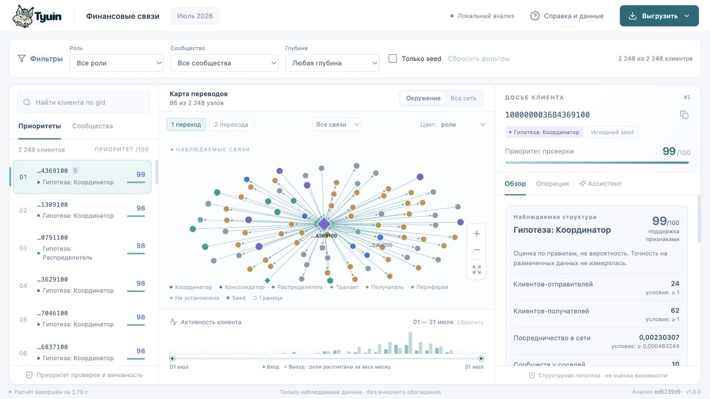
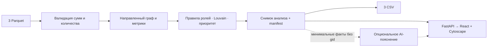

# Tyuin · Финансовые связи


**Tyuin помогает AML-аналитику выбрать, кого из 2 248 клиентов проверить первым и почему.** Из трёх Parquet приложение рассчитывает роли, сообщества и top-20, связывает очередь с направленным графом и досье. Роль раскрывается до признаков и порогов, связь — до исходных операций. Основной сценарий работает локально, без аккаунтов команды, GPU и внешнего AI-сервиса.

**Главное отличие — явный учёт границы наблюдения.** Правило «есть вход, нет выхода → конечный получатель» отнесло бы к `terminal` все 444 узла четвёртого колена. Tyuin сохраняет 441 как `unknown`, ещё 3 получают частичную гипотезу консолидации с поддержкой не выше 0,5. Аналитик видит, где требуется запросить продолжение цепочки, вместо вывода об удержании денег по неполной выборке.

Доказательство: [сравнение правил на исходном наборе](results/benchmark.json), [роли всех узлов](results/nodes_roles.csv) и контрольный `gid=100000000018102100` — глубина 4, наблюдаемый вход 7 000 KZT, роль «Не установлена». Это сравнение структурных правил, **не измерение accuracy**: эталонных ролей нет.

[Быстрый запуск](#запустить-и-проверить) · [Проверить отличие в интерфейсе](#контрольный-пример-граница-наблюдения) · [Пять требований кейса](#требования-кейса-и-проверка)



| Реальный результат | Значение |
|---|---:|
| Клиенты / направленные связи / операции | 2 248 / 3 119 / 4 840 |
| Изолированные seed сохранены | 19 из 19 |
| Сообщества / приоритетные узлы | 88 / 20 |
| Оборот без потери копеек | 365 890 012,01 KZT |

Числа относятся к предоставленной выборке и снимку анализа `ad6239d9995448b0`. Время и условия реальных прогонов указаны в [результатах проверок](#что-проверено).

## Запустить и проверить

Имя продукта — **Tyuin**. Внутренний Python-пакет `moneygraph` и команды запуска сохранены для совместимости. «Граф денег» — название кейса организатора.

Нужен **Python 3.12 или новее**; для воспроизведения полного Windows-прогона используйте 3.12.14. Проверенные среды перечислены [ниже](#что-проверено). Node не нужен для просмотра: готовая сборка React включена в репозиторий. Первичная установка библиотек требует доступа к PyPI; дальнейший основной сценарий — без сети.

Склонируйте репозиторий и перейдите в его корень:

```bash
git clone https://github.com/BAITC-Hacks/hack-9fee8947-uniqore-ai.git
cd hack-9fee8947-uniqore-ai
```

Команды ниже описывают версию [PR #17](https://github.com/BAITC-Hacks/hack-9fee8947-uniqore-ai/pull/17). Пока она не слита в main, после clone выполните `git switch --track origin/codex/local-launch-runtime`. В checkout уже должны быть `data/*.parquet`, `moneygraph/web/` и `requirements.lock`; вручную готовить CSV не нужно.

**Windows, PowerShell:**

```powershell
py -3.12 -m venv .venv
.\.venv\Scripts\python.exe -m pip install -r requirements.lock
.\.venv\Scripts\python.exe -m pip check
.\.venv\Scripts\python.exe scripts/check_environment.py --profile runtime
.\.venv\Scripts\python.exe -m moneygraph demo --data data --out out
```

Активация окружения и изменение `ExecutionPolicy` не нужны. Если установлен Python 3.14, используйте `py -3.14 -m venv .venv`; он также поддерживается. Без launcher укажите полный путь к выбранному Python: [выбор интерпретатора, проверка и ошибки запуска](docs/local-launch.md).

**macOS / Linux:**

```bash
python3.12 -m venv .venv
source .venv/bin/activate
python -m pip install -r requirements.lock
python -m pip check
python scripts/check_environment.py --profile runtime
```

После установки один запуск от исходных Parquet до CSV и интерфейса (в PowerShell он уже указан последней строкой выше):

```bash
python -m moneygraph demo --data data --out out
```

Открыть **[http://127.0.0.1:8765](http://127.0.0.1:8765)**. Остановить сервер — `Ctrl+C`. Если порт занят, добавить `--port 8766`. Сервер по умолчанию слушает только локальный адрес. Внешней deployed-версии сейчас нет.

Признаки успешного запуска: в терминале JSON с `status: "ok"`, затем адрес сервера; в браузере — очередь, граф и досье. `/api/health` возвращает тот же `analysis_id`, что `out/manifest.json`; доступность health отдельно не доказывает загрузку интерфейса. При ошибке данных или зависимостей остановитесь и исправьте её по [инструкции](docs/local-launch.md#если-запуск-не-удался). Повторный расчёт перезаписывает выбранный `--out`; не используйте `results/` как выходной каталог.

Для **NVIDIA Brev** подготовлены Dockerfile и два Compose-конфига: сборка на VM из репозитория и запуск готового образа через Brev Console. [Настройка, запуск и проверка](docs/deployment/brev.md). Облачный запуск пока не проверен.

Только пересчёт или проверка сохранённых результатов; в PowerShell замените `python` на `.\.venv\Scripts\python.exe`:

```bash
python -m moneygraph run --data data --out out
python -m moneygraph verify --data data --out out
python -m moneygraph verify --data data --out results
python -m pytest -q
```

Проверенные артефакты доступны сразу: [роли всех узлов](results/nodes_roles.csv), [сообщества](results/clusters.csv), [топ-20](results/top_nodes.csv), [manifest с параметрами и SHA-256](results/manifest.json). Приложение каждый раз пересчитывает входные файлы, а не читает эти примеры вместо аналитики.

Автоматическая проверка CLI, API, всех локальных assets и трёх CSV без Node и LLM-настроек:

```bash
python scripts/smoke_local_launch.py --data data --out out/readme-check --port 8876
```

Нужны чистый Git checkout и **новый** каталог `out/readme-check`. При повторе выберите другое имя. Успех — `status: "pass"` и код завершения `0`; подробности сохраняются в `out/readme-check/smoke-report.json`. Скрипт останавливает только свой сервер. Preflight проверяет готовность среды; smoke выполняет анализ, но не заменяет проверку интерфейса и Ctrl+C человеком.

## Проверить сценарий аналитика

1. Сбросьте фильтры перед поиском нового клиента, введите полный `gid` и нажмите Enter либо выберите строку очереди. Справа — гипотеза о роли, фактические признаки и пороги, поддержка гипотезы, приоритет, потоки и ограничения. В раскрываемом объяснении видны порядок правил и расчёт поддержки.
2. На графе выберите окружение в 1–2 перехода, направление или всю сеть. Цвет переключается между ролями и сообществами; seed — ромб, граница — пунктир.
3. Нажмите узел, чтобы открыть его досье; ребро — чтобы увидеть операции именно этой пары. Идентификатор источника `hash:row` указывает нулевой номер строки оригинального `transactions.parquet` и префикс его SHA-256.
4. Выберите дни на временной шкале или ползунками. Неактивные связи приглушаются, список операций меняется; роли и приоритеты остаются месячными, что явно подписано.
5. Откройте «Ассистент» для объяснения готовых фактов или «Выгрузить» для одного из трёх обязательных CSV. В единой «Справке и данных» находятся сводка набора, метод и ограничения; оттуда можно показать клиентов на границе наблюдения.

Фильтры по роли, сообществу, seed и глубине постоянно видны над рабочей областью и действуют на очередь, список сообществ и граф. Ввод `gid` переключает список на «Приоритеты». Если выбранный клиент скрыт фильтром, досье сохраняется с предупреждением; можно показать всю выборку на графе или сбросить фильтры. Число узлов над графом относится к текущему виду графа. В сообществах отдельно показаны число участников в выборке и общие показатели сообщества.

На широком экране три панели занимают оставшуюся высоту окна и прокручиваются независимо. Дублирующая навигация и статические карточки убраны с рабочего экрана. Изменения компоновки и выполненные сценарии записаны в [отчёте UX-проверки](docs/finance/ux-validation.md).

Примеры для живого разбора, полученные из результата, а не заданные классификатору:

| `gid` | Что показать |
|---|---|
| `100000003684369100` | Первый в очереди: разные компоненты приоритета, неполный вход seed |
| `100000000031787100` | Транзитная гипотеза: вход и выход по 90 000 KZT, временная совместимость |
| `100000000456947100` | Изолированный seed: находится поиском, роль неизвестна, приоритет 0 |
| `100000000018102100` | Четвёртое колено: отсутствие выхода объясняется границей наблюдения |

[Сценарий пятиминутной демонстрации](docs/finance/demo.md), [исходная локальная проверка](docs/finance/validation.md) и [проверка UX-итерации](docs/finance/ux-validation.md).

### Контрольный пример: граница наблюдения

1. Сбросьте фильтры, найдите `100000000018102100` и выберите строку очереди. В досье ожидаются «Не установлена», «4-е колено», вход 7 000 KZT и нулевой наблюдаемый выход.
2. В «Ассистенте» нажмите «Почему эта роль?». Локальное объяснение указывает на глубину 4 и ненаблюдаемые дальнейшие переводы. Следующий шаг в обзоре — запросить исходящие переводы следующего колена. Нулевой выход не объявляется доказательством удержания средств.
3. Найдите `100000000456947100`: этот изолированный seed остаётся в очереди и графе с неизвестной ролью и приоритетом 0. Отсутствие узла или назначение ему роли получателя — расхождение с ожидаемым результатом.
4. Скачайте «Все узлы и роли»: оба gid должны присутствовать в CSV. Для проверки границы и изолятов на всём наборе выполните `python -m pytest tests/test_analysis.py::test_censored_nodes_seeds_isolates -q`.

Для включённого внешнего AI формулировка может отличаться. Проверяются согласованность с числами и ограничениями досье и ссылки на факты; роль, приоритет и CSV от текста ответа не меняются.

## Требования кейса и проверка

Нумерация соответствует пяти обязательным пунктам [ТЗ кейса](docs/finance/requirements.md#3-пять-обязательных-требований); первичный источник — [PDF организатора](docs/finance/sources/case.pdf). Таблица показывает реализацию и способ проверки, а не оценку жюри или подтверждение допуска.

| Требование ТЗ | Реализация и граница | Как проверить |
|---|---|---|
| 1. Один запуск от Parquet до трёх CSV менее чем за 5 минут | `run` рассчитывает и проверяет результаты без ручной разметки; измерения относятся к данному набору | `python -m moneygraph run --data data --out out`; затем `verify`; полный замер — smoke и [отчёт Windows](https://github.com/BAITC-Hacks/hack-9fee8947-uniqore-ai/blob/834ecaf921e1c4551a33c80d7781cf1c6746acc5/docs/sdd/local-launch/evidence/CHECK-008.json) |
| 2. Роль, скор и объяснение каждого из 2 248 узлов | Все узлы, включая 19 изолятов, входят в `nodes_roles.csv`; `role_score` — поддержка правила | [CSV](results/nodes_roles.csv), `verify`; контракт полей проверяется в [тестах](tests/test_analysis.py) |
| 3. Документированные, объяснимые критерии ролей | [Правила и формулы](#роли-и-поддержка-гипотезы), пороги в manifest, признаки в досье | Найти три произвольных gid и разобрать условия роли; автоматические тесты не заменяют устный разбор команды за минуту |
| 4. Кластеры, состав, оборот и гипотеза назначения | 88 сообществ, `cluster_id` у каждого узла; гипотеза пока описывает структуру и преобладающую роль, а не конкретное назначение группы | [clusters.csv](results/clusters.csv), вкладка «Сообщества»; содержательность гипотезы требует отдельной оценки |
| 5. Не менее 20 приоритетных узлов с основаниями и направленный граф | Top-20 с кратким `why`; в досье — четыре компонента приоритета; граф показывает роли и сообщества | [top_nodes.csv](results/top_nodes.csv), поиск gid, выбор узла/ребра и переключение цвета графа |

## Что проверено

| Среда и версия | Реально выполнено | Доказательство |
|---|---|---|
| Windows 11 x64, Python 3.12.14, commit `60276af` | 71 тест; preflight и `pip check`; CLI/API, 3 CSV, все assets, браузер, Ctrl+C и занятый порт. Новый процесс `run`: **6,7669 с**; весь smoke: **20,1606 с** | [Отчёт с SHA, командами и ограничениями](https://github.com/BAITC-Hacks/hack-9fee8947-uniqore-ai/blob/834ecaf921e1c4551a33c80d7781cf1c6746acc5/docs/sdd/local-launch/reviews/T-004.md) |
| Windows 11 x64, Python 3.14.5, commit `bb0c5d0` | Новый venv, установка lock, preflight, `pip check`, 14 тестов окружения. Полный smoke под 3.14 этим прогоном не подтверждён | [Отчёт Python 3.14](https://github.com/BAITC-Hacks/hack-9fee8947-uniqore-ai/blob/834ecaf921e1c4551a33c80d7781cf1c6746acc5/docs/sdd/local-launch/evidence/bb0c5d0/python314.json) |
| macOS arm64, Python 3.12.1, исходная версия анализа | Новый процесс: **27,0019 с**, пиковая память **197,16 MiB**; отдельный повтор **7,59 с** | [Исходное измерение](results/benchmark.json), [повтор](results/repeat-benchmark.json), [контекст версии](docs/finance/validation.md) |
| Docker, Linux amd64, версия конфигурации Brev | Сборка, запуск, API, CSV, браузер, перезапуск и 29 тестов той версии | [Отчёт и проверенный commit](docs/deployment/brev.md#проверка-конфигурации) |

Измерения `run` включают новый Python-процесс, импорты, анализ, запись CSV и verify; установка исключена, кэш ОС не очищался. Это результаты отдельных машин, не сравнение производительности платформ. Память на Windows не измерялась. После `60276af` здесь редактируется README; таблица фиксирует прежние фактические прогоны, а не новый запуск всех тестов.

Техническая проверка Windows выполнена агентами. Повторение инструкции вторым участником и подтверждение локальной приёмки остаются открыты по [спецификации](docs/specs/local-launch.md). Прямой Python-запуск на Linux, реальный Brev-инстанс и живой внешний LLM в этой проверке не испытывались.

## Как получается результат



Ядро — [moneygraph/analysis.py](moneygraph/analysis.py), API — [server.py](moneygraph/server.py), интерфейс — [frontend/src](frontend/src). API и экспорты привязаны к одному `analysis_id`; сервер держит неизменяемый результат в памяти. Даже перезапись каталога `out` другим запуском не подменяет CSV открытого сервера.

- Деньги суммируются в целых тиынах. Сумма и число операций каждой пары проверяются по `edges.parquet`.
- Все узлы добавляются из `nodes.parquet`, включая изоляты. 97 совпадающих строк операций сохранены: без transaction ID нет основания удалять их как повторы.
- Метрики: степени, суммы и количества, взвешенный PageRank, направленная невзвешенная betweenness, достижимость от других seed до четырёх переходов.
- Louvain: ненаправленная проекция с суммой весов обоих направлений, `seed=42`, `resolution=1`; номера сообществ упорядочены по минимальному gid, изоляты получают отдельные сообщества. Оборот кластера включает только внутренние направленные рёбра, каждое один раз.
- FIFO учитывает совместимый вход и последующий выход через 1–2 дня, без повторного использования объёма. Переводы одного дня не сопоставляются: порядок внутри дня неизвестен. Это совместимость, не доказанная трассировка денег.
- `gid` остаётся целым десятичным идентификатором в CSV и строкой в API/браузере. При открытии CSV в Excel импортируйте этот столбец как текст: значения превышают точность чисел JavaScript и Excel.

### Роли и поддержка гипотезы

Правила применяются сверху вниз. Пороги рассчитываются на входном наборе и записываются в manifest. `P75` — квантиль **положительных** степеней; `Q` — средний процентиль среди активных узлов, при нулевой метрике 0.

| Роль | Условие | `role_score` |
|---|---|---|
| `unknown` | Нет наблюдаемых связей | 0 |
| `coordinator` | Есть вход/выход; betweenness ≥ P90 положительных значений; соседи в ≥2 сообществах; достижим от ≥2 других seed | Среднее Q посредничества и достижимости |
| `consolidator` | Входящая степень ≥ max(3, ceil(P75)) и ≥2 × исходящая; на границе достаточно подтверждённой входящей степени | Среднее Q входящей степени и числа переводов; на границе максимум 0,5 |
| `distributor` | Исходящая степень ≥ max(10, ceil(P75)); для не-seed также ≥2 × входящая | Среднее Q исходящей степени и числа переводов |
| `transit` | Не seed; глубина <4; есть вход и выход; отношение сумм 0,8–1,2 | 0,6 × min(вход, выход)/max + 0,4 × сопоставленный объём/max |
| `terminal` | Есть вход, нет наблюдаемого выхода, глубина <4 | Среднее Q входящей суммы и числа переводов |
| `unknown` | Граница без достаточных признаков другой роли | 0 |
| `peripheral` | Остальные наблюдаемые узлы | 1 − max(Q степени, Q объёма, Q посредничества) |

В этой выборке пороги степеней — 3 и 10. `terminal` в интерфейсе называется «Получатель»: даже внутри границы это наблюдаемая структура, а не подтверждение удержания денег. `unknown` — документированное расширение словаря, разрешённое ТЗ.

`role_score` — некалиброванная поддержка структурной гипотезы, **не вероятность и не измеренная точность**. В интерфейсе это баллы из 100, отдельно от приоритета; баллы разных ролей не сравниваются. Досье показывает наблюдаемые значения, условия выбранного правила, причины отклонения предыдущих правил и формулу поддержки. Правило `peripheral` — остаточное; у высокоактивного узла поддержка этой роли может быть низкой. Роль не исключает его из очереди.

### Приоритет проверки

```text
0,35 × Q(max(входящая сумма, исходящая сумма))
+ 0,25 × Q(betweenness)
+ 0,25 × Q(достижимость от других seed)
+ 0,15 × Q(число участий в переводах)
```

Изоляты имеют 0. Равные приоритеты после округления до 6 знаков упорядочиваются по gid. Коэффициенты — прозрачные начальные настройки без обучения на разметке. В досье раскрываются четыре слагаемых. `role_score` и `priority_score` независимы: отсутствие уверенной роли не означает низкий приоритет проверки.

### AI: только пояснения

Обязательные результаты вычисляются локальными алгоритмами. По умолчанию три вопроса ассистенту возвращают подписанные пояснения из рассчитанных фактов. Свободного чата и автономных действий в этой версии нет.

Опционально backend поддерживает совместимый с Chat Completions API провайдер. Перед запуском сервера задайте в окружении `LLM_BASE_URL` (с базовым `/v1` при необходимости), `LLM_MODEL`, `LLM_API_KEY`. Имена приведены в [.env.example](.env.example); файл `.env` автоматически не загружается. Ключ не передаётся браузеру и не входит в Git.

Провайдер получает только три коротких текста с метриками, ограничениями и псевдонимом «Клиент A», без исходных gid и транзакций. Ответ должен ссылаться на существующие ключи доказательств. Ошибка, неверный JSON или тайм-аут 15 секунд возвращают локальное объяснение. Внешний ответ не меняет роли, приоритеты и CSV; проверка ссылок не гарантирует истинность каждой фразы. Живой внешний API в этой версии не проверялся: контракт и отказы проверены имитацией ответов в тестах.

## Данные, технологии и разработка

[Три исходных Parquet](data/) предоставлены для этого кейса; SHA-256 зафиксированы в manifest. Данные обезличены и предназначены исключительно для хакатона. Никакого внешнего обогащения или вымышленных атрибутов нет. [ТЗ и исходное описание](docs/finance/README.md).

Python-среды и объём их проверки перечислены [выше](#что-проверено). Зависимости: FastAPI 0.141.1, pandas 2.3.3, PyArrow 24.0.0, NumPy 2.5.3, NetworkX 3.7. Полный Python-набор — [requirements.lock](requirements.lock), frontend — [frontend/package-lock.json](frontend/package-lock.json). React + TypeScript + Vite + Cytoscape; системные шрифты и локальные ассеты, без CDN.

Изменение интерфейса (Node 22.12+; фактически проверен Node 25.8.1):

```bash
cd frontend
npm ci
npm run dev
# в другом терминале запускается Python demo на 8765;
# Vite выводит адрес разработки и перенаправляет /api на backend
npm run format:check
npm run build
```

Сборка сохраняется в `moneygraph/web/` и коммитится вместе с исходниками. Рабочие изменения выполняются в **отдельной ветке каждой задачи → локальная проверка → PR в main**. Постоянной ветки dev нет. Слияние требует подтверждения локальной приёмки; [правила](docs/development-workflow.md).

## Ограничения и следующий масштаб

Один банк, июль 2026, исходящий обход на четыре колена и суммы от 5 000 KZT. Внешние входы, остатки и продолжение границы неизвестны. Нет эталонных ролей, поэтому accuracy, recall и доказанная эффективность расследования не заявляются. Сообщества не равны преступным группам; все назначения — гипотезы.

Сейчас реализованы роли, кластеры, приоритет, временная совместимость, досье, фильтры и объяснения. Отдельные детекторы циклов, дробления, стресс-тест удаления top-N и свободный AI-чат отложены. Интерфейс предназначен прежде всего для ноутбука; на узком экране панели идут вертикально.

Гипотеза сообщества пока является структурной сводкой; конкретное назначение группы не устанавливается. Краткий `why` в top-20 не раскрывает все слагаемые приоритета — полный состав доступен в досье. [Содержательные гипотезы кластеров](docs/specs/cluster-purpose-hypotheses.md) и [полные объяснения в CSV](docs/specs/priority-explanations.md) находятся в бэклоге. Эти ограничения важны при оценке обязательных пунктов 4 и 5.

**При росте до миллиона узлов:** агрегировать Parquet пакетами через DuckDB/Polars; заменить Python-объекты компактным графом и вынести расчёт в отдельный процесс; считать приближённую betweenness на выборке и ограниченные локальные признаки; использовать Leiden/Louvain в igraph; хранить снимки и индексировать gid; выдавать в браузер только окружение, серверные фильтры и агрегаты. Сохранить версионирование правил и контроль сумм. Проверять время, память, стабильность top и роль границы на отдельном нагрузочном наборе. Такой масштаб **не реализован и не измерен**.

[Архитектурный план](docs/finance/architecture.md) · [Фактическая реализация](docs/finance/implementation.md) · [Проверка по критериям](docs/finance/validation.md).

[Документация проекта](docs/README.md) · [Agentic SDD pipeline: план разработки через Codex и Claude Code](docs/agentic-sdd-pipeline/README.md).

[Бренд, логотип и исходные скетчи](docs/brand/README.md) · [Проверка ребрендинга](docs/brand/tyuin/v1.0.2/validation.md).
