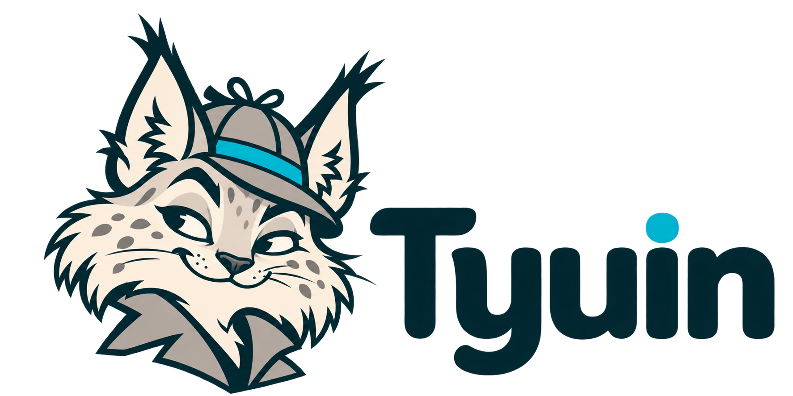

# Tyuin — бренд

**Tyuin** — рабочее место AML-аналитика: финансовые связи, основания для проверки и границы наблюдаемых данных. Персонаж бренда — любопытная рысь-сыщик с хитрым прищуром.

Текущее написание: **Tyuin**, именно в таком порядке букв. Это имя продукта. «Граф денег» остаётся названием кейса организатора, а `moneygraph` — внутренним именем Python-пакета и команды запуска.

## Взять нужный файл

| Материал | Файл |
|---|---|
| Утверждённый логотип с надписью, прозрачный PNG | [tyuin-logo.png](tyuin/v1.0.0/assets/tyuin-logo.png) |
| Рысь без надписи, прозрачный PNG | [tyuin-icon.png](tyuin/v1.0.0/assets/tyuin-icon.png) |
| Палитра, правила и история выбора | [Бренд-пакет v1.0.0](tyuin/v1.0.0/README.md) |
| Исходные генерации и скетчи | [Оригиналы](tyuin/v1.0.0/originals/) |
| Открытое описание визуального направления | [Дизайн-бриф](tyuin/v1.0.0/design-brief.md) |
| Целостность исходников и ассетов | [SHA256SUMS](tyuin/v1.0.0/SHA256SUMS) |
| Проверка ребрендинга и экран приложения | [Отчёт](tyuin/v1.0.0/validation.md) |

Оригинальные PNG сохранены без пересохранения. Это растровые исходники генерации: редактируемого векторного файла, файла шрифта или послойного макета у них нет. Новые редакции сохраняются в новой версии; существующие оригиналы не заменяются.
