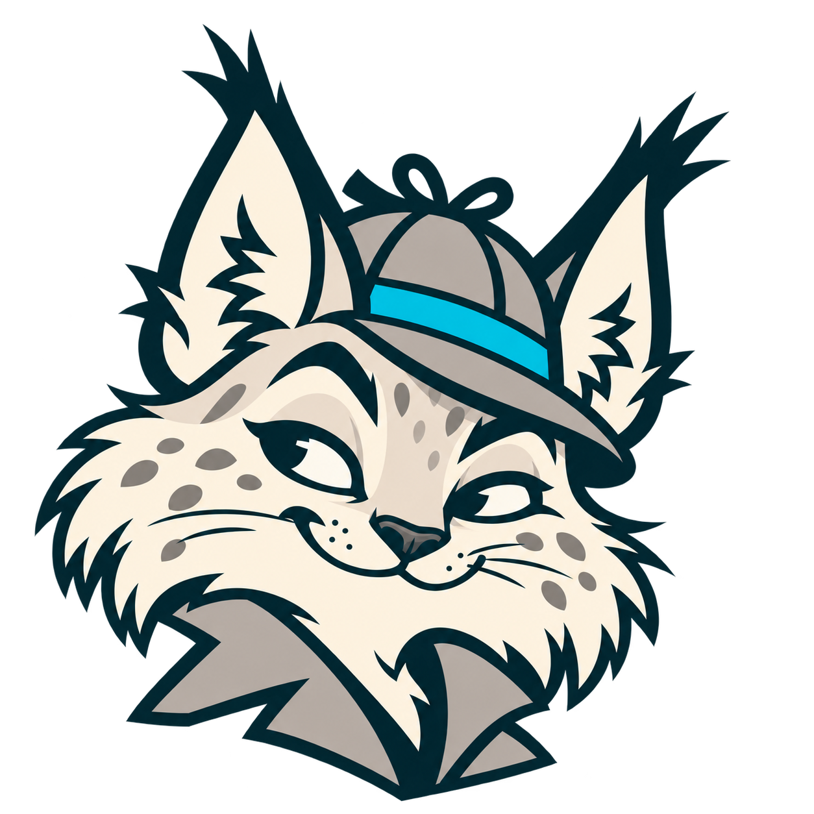
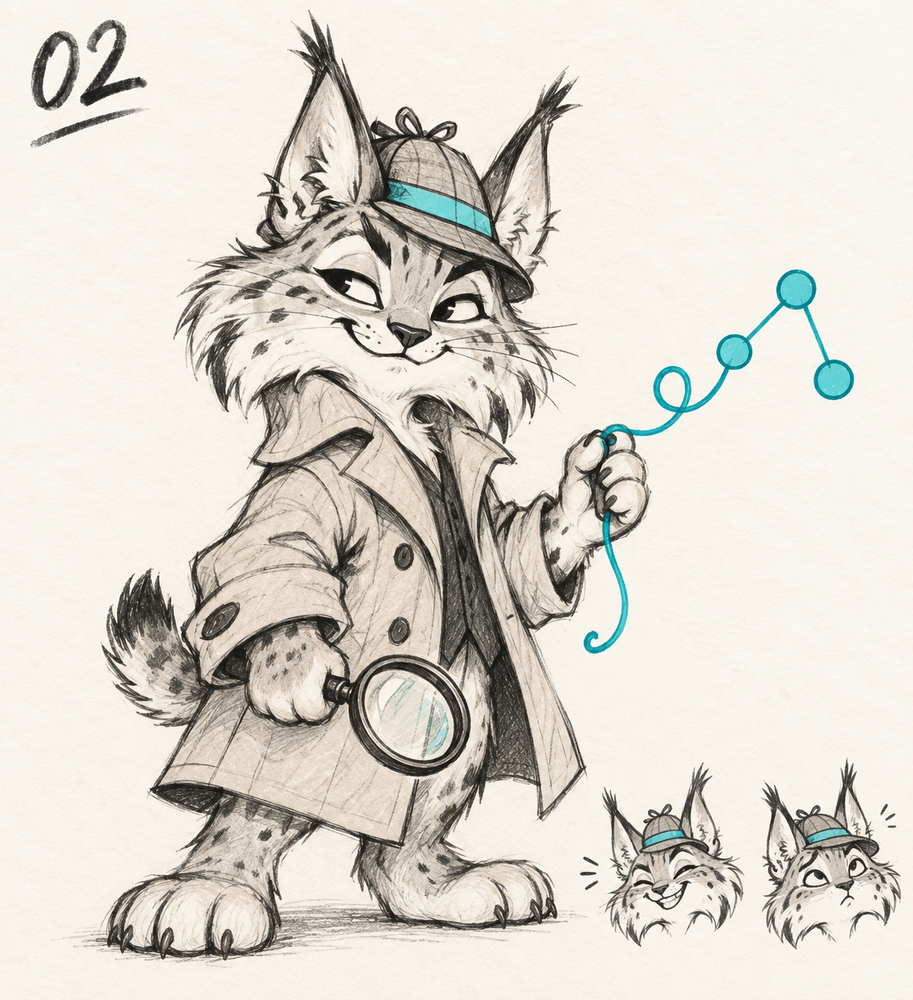

# Tyuin · бренд-пакет v1.0.0

Дата: 23.09.2026. Пользователь выбрал рысь из четырёх персонажей, утвердил логотип и поручил сохранить материалы и перебрендировать решение.




## Файлы и происхождение

| Файл | Назначение и статус |
|---|---|
| [assets/tyuin-logo.png](assets/tyuin-logo.png) | 1774 × 887, RGBA PNG. Побайтовая копия утверждённого логотипа |
| [assets/tyuin-icon.png](assets/tyuin-icon.png) | 1254 × 1254, RGBA PNG. Производный знак для навигации и favicon, подготовлен на основе утверждённого логотипа |
| [originals/](originals/) | Все семь оригинальных результатов ImageGen, без изменения байтов |
| [design-brief.md](design-brief.md) | Публичное описание направления и требований к производному знаку |
| [SHA256SUMS](SHA256SUMS) | SHA-256 всех PNG в `originals/` и `assets/` |

Изображения созданы встроенным ImageGen. Финальный логотип сделан по выбранному скетчу; отдельная иконка — последующим редактированием финального логотипа, а не векторной обводкой. Текстовая часть логотипа — часть изображения, отдельного лицензируемого шрифта в пакете нет. Доступность имени и товарного знака этим пакетом не подтверждается.

## Палитра интерфейса

Цвета ниже — зафиксированные UI-токены, подобранные к изображению, а не утверждение о точном цветовом составе каждого пикселя исходника.

| Цвет | HEX | Использование |
|---|---|---|
| Тёмный petrol | `#00313D` | Название, контуры и сильные акценты |
| Бирюзовый | `#00B5C8` | Декоративные акценты и детали персонажа |
| Тёмная бирюза | `#006B75` | Кнопки с белым текстом, ссылки, фокус и выбранные элементы |
| Светлая бирюза | `#E8F6F5` | Фон выбранных элементов |
| Бирюзовая граница | `#B7DEDF` | Обводки активных элементов |
| Светлый фон | `#F5F7FA` | Рабочее пространство |

Яркий бирюзовый не используется для мелкого текста на белом. Цвета аналитических ролей — отдельная смысловая палитра: изменение бренда не меняет значения ролей и легенду графа.

## Использование

- Основной логотип — рысь с надписью **Tyuin** на светлом фоне. Сохранять пропорции 2:1; не растягивать и не набирать надпись поверх изображения.
- Для маленьких мест используется рысь без надписи: в боковой панели она отображается в 48 × 48 CSS px, браузер масштабирует её для вкладки.
- Оставлять свободное пространство вокруг ушей и воротника. Не обрезать кисточки, не добавлять плашки поверх лица и не менять выражение.
- Тон: внимательный, понятный, с лёгкой иронией. Рысь помогает увидеть связи; выводы о клиентах остаются гипотезами, а не обвинениями.
- Не перезаписывать оригиналы. Для будущих изменений создавать новую версию рядом с `v1.0.0`.

## История выбора

| Этап | Исходник | Статус |
|---|---|---|
| Первое направление — узел | [01-knot-logo-concept.png](originals/01-knot-logo-concept.png) | Архив, заменён персонажем |
| Сыщик-человек | [02-inspector-sketch.png](originals/02-inspector-sketch.png) | Альтернативный скетч |
| Рысь-сыщик | [03-lynx-sketch-selected.png](originals/03-lynx-sketch-selected.png) | Выбран пользователем |
| Ворон-сыщик | [04-raven-sketch.png](originals/04-raven-sketch.png) | Альтернативный скетч |
| Живой узелок | [05-knot-detective-sketch.png](originals/05-knot-detective-sketch.png) | Альтернативный скетч |
| Логотип с рысью | [06-lynx-logo-approved.png](originals/06-lynx-logo-approved.png) | Утверждён пользователем |
| Рысь без надписи | [07-lynx-icon-derived.png](originals/07-lynx-icon-derived.png) | Производный файл для приложения |



## Обновить копии приложения

Из корня репозитория:

```bash
cp docs/brand/tyuin/v1.0.0/assets/tyuin-logo.png frontend/public/tyuin-logo.png
cp docs/brand/tyuin/v1.0.0/assets/tyuin-icon.png frontend/public/tyuin-icon.png
cd frontend
npm run build
```

Vite переносит обе картинки в `moneygraph/web/`, поэтому приложение работает локально без CDN и без доступа к генератору. В Git хранятся исходники frontend и готовая сборка. Копии изображений в этих трёх местах должны совпадать побайтово.
