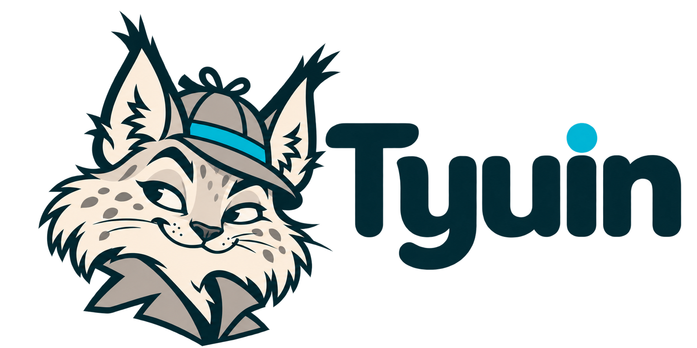

# Tyuin · горизонтальный логотип v1.0.1

Дата: 23.09.2026. Исправление по замечанию пользователя: надпись в исходной горизонтальной композиции располагалась слишком низко относительно рыси и соседнего текста в шапке приложения.



В новой редакции надпись поднята для оптического выравнивания. Сохранены написание **Tyuin**, выбранный облик рыси, характер букв и палитра. Размер — 1774 × 887, RGBA PNG с прозрачным фоном.

- [Логотип для использования](assets/tyuin-logo.png).
- [Оригинальный результат редактирования](originals/01-horizontal-alignment.png).
- [Контрольные суммы](SHA256SUMS).
- [Проверка в интерфейсе](validation.md).
- [Иконка без надписи](../v1.0.0/assets/tyuin-icon.png) — прежняя версия, без изменений.
- [Палитра, правила и исходные скетчи](../v1.0.0/README.md) — сохранены в v1.0.0.

Редактирование выполнено встроенным ImageGen по [логотипу v1.0.0](../v1.0.0/assets/tyuin-logo.png). Публичное задание: поднять целиком блок надписи, сохранив её положение по горизонтали, размер, формы букв и цвет; сохранить рысь, прозрачность и пропорции полотна. Результат является растровым редактированием, не послойным макетом и не побайтовым перемещением исходных пикселей. Канонический PNG сохранён вместе с хэшем.

Предыдущая версия и её оригиналы не перезаписаны. Текущая копия приложения обновляется из корня репозитория:

```bash
cp docs/brand/tyuin/v1.0.1/assets/tyuin-logo.png frontend/public/tyuin-logo.png
cd frontend
npm run build
```
