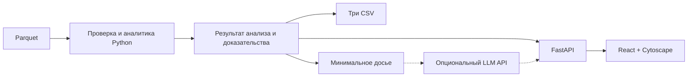

# «Граф денег»: светлый аналитический центр, рабочая версия с первой итерации

## 1. Решение и результат проверки плана

**Frontend — React. Аналитика — Python. Между ними — FastAPI.** Streamlit исключаем, поскольку он сам отвечает за построение интерфейса, а выбранный React позволяет напрямую управлять графом, панелями и переходами.

Цель: выразительное рабочее место аналитика, где выбор клиента сразу связывает **очередь проверки → граф переводов → досье доказательств**.

Статус: согласованный план разработки от 23.09.2026. Реализация ещё не начата; команды, функции и показатели скорости ниже являются требованиями к будущей версии, а не результатами запуска.

Условия кейса и критерии приведены в [спецификации](requirements.md), первоисточник — [ТЗ организатора](sources/case.pdf). Порядок веток, проверки и выпуска — в [правилах разработки](../development-workflow.md).

На этом этапе публикуется только документация. Реализация начинается по отдельной команде пользователя.

## 2. Интерфейс: светлая разведаналитика

**Визуальное направление:** светлый фон, белые панели, тёмно-синяя типографика, тонкие разделители, выразительный граф. Ощущение центра расследования создают композиция, точность взаимодействий и раскрытие связей.

```text
┌────────────────────────────────────────────────────────────────┐
│ ГРАФ ДЕНЕГ    Июль 2026    Поиск клиента       Статус · Экспорт  │
├───────────────┬───────────────────────────┬────────────────────┤
│ Очередь       │                           │ Досье клиента      │
│ проверки      │     ГРАФ ПЕРЕВОДОВ        │ Роль · Приоритет   │
│               │                           │ Основания          │
│ Кластеры      │     Выбранный узел        │ Связи и операции   │
│ Фильтры       │     и его окружение       │ Ограничения данных │
├───────────────┴───────────────────────────┴────────────────────┤
│ Активность по дням      Выбранный период       Детали операций  │
└────────────────────────────────────────────────────────────────┘
```

**Дизайн фиксируем сразу:**

- Фон `#F4F6F8`, панели `#FFFFFF`, основной текст `#142234`, выделение `#2962FF`, ограничения — янтарным.
- Системный шрифт с поддержкой кириллицы; табличные цифры для сумм, моноширинное отображение идентификаторов.
- Левая панель около 280 px, правая — 360 px, центральная область занимает оставшееся пространство.
- Направления переводов показаны стрелками; роли различаются цветом и подписью, seed — формой, граница выгрузки — контуром.
- Плавные переходы 150–250 мс при выборе и фокусировке. Позиции узлов сохраняются между фильтрами.
- Постоянные подписи только у выбранного узла и значимых соседей; подробности раскрываются по наведению или выбору.
- Все видимые действия работают с реальными результатами. Данные, статусы и активность не имитируются.

**Основные взаимодействия:**

1. Выбор через поиск, очередь или граф синхронно обновляет все панели.
2. Переключение между входящими и исходящими связями, окружением в один или два перехода и всей сетью.
3. Фильтрация по роли, кластеру, seed и глубине с числом показанных/скрытых узлов.
4. Переход от объяснения к конкретным рёбрам и транзакциям.
5. Выбор диапазона дат подсвечивает активные связи и суммы за период. Месячные роли и приоритет остаются прежними; это явно подписано.
6. Скачивание обязательных CSV из того же результата, который открыт на экране.

Первый экран открывается с очередью и выбранным верхним узлом. Изолированный клиент также находится поиском и получает полноценную карточку с объяснением отсутствия связей.

## 3. Архитектура и аналитические контракты

**Стек:** React + TypeScript + Vite, Cytoscape.js; Python 3.11 + FastAPI + pandas + PyArrow + NumPy + NetworkX.



FastAPI обслуживает API и готовую веб-сборку. Node требуется для разработки и пересборки; жюри получает готовый frontend вместе с Python-пакетом. Все ресурсы интерфейса локальные. Такой способ раздачи файлов поддерживается [FastAPI](https://fastapi.tiangolo.com/tutorial/static-files/); сборку выпускает [Vite](https://vite.dev/guide/build.html).

**Планируемые команды:**

```bash
python -m moneygraph run --data ./data --out ./out
python -m moneygraph demo --data ./data --out ./out
python -m moneygraph verify --data ./data --out ./out
```

`demo` пересчитывает данные и запускает приложение на `127.0.0.1:8765`. `run` создаёт результаты без интерфейса. `verify` проверяет согласованность данных и выгрузок.

**Контракты между компонентами:**

- Единственный `analysis_id` объединяет граф, досье, CSV и manifest запуска.
- В браузере все `gid` — строки; даты — `YYYY-MM-DD`, без преобразования часового пояса.
- Один `selected_gid` управляет всеми панелями. Если фильтр скрывает выбранный узел, карточка сохраняется с соответствующей отметкой.
- API предоставляет сводку/граф, досье узла, сведения о кластере, скачивание CSV и отдельный запрос AI-пояснения.
- UI читает готовые расчёты; фильтры не запускают классификацию заново.
- Неизвестный узел, ошибка анализа и отсутствие результата имеют явные состояния интерфейса.

**Обязательные выгрузки:**

| Файл | Поля |
|---|---|
| `nodes_roles.csv` | `gid, role, role_score, cluster_id, priority_score, evidence` |
| `clusters.csv` | `cluster_id, n_nodes, n_seed, sum_kzt_internal, top_gids, hypothesis` |
| `top_nodes.csv` | `rank, gid, role, priority_score, why` |

Все 2 248 узлов включаются в граф и экспорт. Объяснение `evidence` содержит числа и занимает не более 200 символов. Top содержит 20 узлов.

**Аналитическое ядро:**

- Проверять суммы и количества транзакций по каждой паре. Деньги считать в тиынах; одинаковые записи без `transaction_id` сохранять.
- Считать входящие/исходящие степени, суммы и количества, PageRank, направленную невзвешенную betweenness и достижимость от других seed на расстоянии до четырёх переходов.
- Louvain выполнять на ненаправленной проекции с суммой весов обоих направлений, `seed=42`, `resolution=1`. Нумерация кластеров стабильная; изоляты получают отдельные кластеры.
- Гипотезу кластера формировать из его состава, ролей, seed и оборотов, включая вариант «данных недостаточно».

Начальные правила ролей применяются последовательно:

| Роль | Условие |
|---|---|
| `unknown` | Изолированный узел |
| `coordinator` | Есть вход и выход; betweenness ≥ P90 положительных значений; соседи минимум в двух кластерах; достижимость от двух других seed |
| `consolidator` | Входящая степень ≥ `max(3, ceil(P75))` и вдвое больше исходящей; на границе учитывать только подтверждённый вход и отмечать частичную гипотезу |
| `distributor` | Исходящая степень ≥ `max(10, ceil(P75))` и вдвое больше входящей; для seed сравнение с неполным входом исключить |
| `transit` | Не seed, глубина < 4, есть вход и выход, отношение сумм 0,8–1,2 |
| `terminal` | Есть вход, нет наблюдаемого выхода, глубина < 4 |
| `unknown` | Граничный узел без достаточных признаков другой роли |
| `peripheral` | Остальные наблюдаемые узлы |

P75 считается отдельно по положительным входящим/исходящим степеням. Расширение `unknown` документируется: ТЗ допускает дополнительные роли.

`role_score` означает поддержку гипотезы. Для coordinator усреднять процентили betweenness и достижимости; для consolidator/distributor — соответствующей степени и количества переводов; для terminal — входящей суммы и количества. Граничный consolidator получает максимум 0,5; unknown — 0. Для peripheral использовать `1 − max` процентилей степени, оборота и betweenness.

Приоритет сохраняется независимым от поддержки роли:

```text
0,35 × Q(max(вход, выход))
+ 0,25 × Q(betweenness)
+ 0,25 × Q(достижимость от seed)
+ 0,15 × Q(количество транзакций)
```

`Q` — процентиль среди активных узлов; нулевые значения получают 0, одинаковые — одинаковый ранг. Изоляты имеют приоритет 0; равные приоритеты упорядочиваются по `gid`. Пороги и коэффициенты документируются как некалиброванные настройки.

## 4. Сначала рабочая версия, затем итерации

**V0 — первый сквозной результат.** Цель — получить его за 60–90 минут при параллельной работе над аналитикой, frontend и интеграцией; это оценка, не гарантия.

В V0 уже входят реальные роли и кластеры, приоритеты, три заполненных CSV, светлая композиция экрана, направленный граф, поиск, связанная карточка и минимальный README. Проверяется путь от исходных Parquet до скачивания результата.

Для transit в V0 поддержка равна сходству сумм `min(вход, выход)/max(вход, выход)`. Временной анализ помечается как ещё не реализованный и не изображается в интерфейсе.

**Итерация 1 — раскрытие доказательств.**

- Добавить дневную активность и детали операций.
- Реализовать FIFO-сопоставление входа и последующего выхода через 1–2 дня без повторного использования объёма.
- Обновить поддержку transit до `0,6 × сходство сумм + 0,4 × временное соответствие`.
- Сменить версию алгоритма и полностью пересчитать согласованный результат. Временное соответствие показывать как гипотезу, а не доказанное происхождение денег.

**Итерация 2 — визуальная доводка.**

- Отладить компоновку, плотность информации, легенды и контраст.
- Добавить плавную фокусировку, сохранение позиции графа и удобное возвращение к обзору.
- Проверить реальные экраны и основной сценарий; исправить переполнения и неудобные переходы.

**Итерация 3 — AI-пояснения.**

Три действия: «Почему эта роль?», «Почему этот приоритет?», «Каких данных не хватает?». Использовать имеющийся API, минимальное досье с псевдонимами и ссылки на локальные доказательства. Проверять возвращённые идентификаторы доказательств. Ключ хранится только на backend.

Без ключа, при ошибке или тайм-ауте 15 секунд работает подписанное шаблонное объяснение. Основной сценарий остаётся доступным полностью.

Каждая итерация заканчивается запускаемой версией, актуальным README и проверкой по [протоколу оценки изменений](../development-workflow.md#проверка-изменений). Проверка выполняется перед существенным изменением, после его завершения и для объединённой версии перед сдачей.

Пять часов — бюджет исходного проектирования, а не предполагаемый остаток времени. При приближении подтверждённого дедлайна приоритет получают проверка и сдача уже работающей версии.

## 5. Приёмка и соответствие критериям

| Критерий кейса | Вес | Доказательство в решении |
|---|---:|---|
| Соответствие задаче | 25 | Пять must-have работают уже в V0 |
| Техническая реализация | 25 | Общий результат для API, графа, досье и CSV; корректность расчётов |
| README и воспроизводимость | 25 | Один локальный запуск, фиксированные зависимости, проверенный сценарий |
| Ценность | 15 | Аналитик переходит от приоритета к основаниям и следующему действию |
| Потенциал и оригинальность | 10 | Наглядная работа с неполнотой данных и обоснованный путь масштабирования |

**Обязательные проверки:**

- Все 2 248 идентификаторов сохранены; 19 изолятов доступны; суммы и количества сходятся.
- Depth=4 не означает автоматически terminal; неполный вход seed не создаёт ложное доказательство transit.
- Высокоприоритетный узел с неопределённой ролью остаётся в очереди.
- Перестановка входных строк не меняет аналитический результат.
- Выбор через очередь, поиск и граф открывает одно и то же досье; длинные `gid` не искажаются.
- Диапазон дат меняет активность, сохраняя явно обозначенные месячные роли.
- Экспорт соответствует открытому `analysis_id`.
- Холодный расчёт занимает менее 300 секунд; обязательные функции работают без LLM и внешних ресурсов.

**Визуальная приёмка:** реальные экраны 1366×768, 1440×900 и 1920×1080; читаемые суммы и идентификаторы, доступные действия, отсутствие перекрытий. Цели для измерения: первоначальная отрисовка графа до 3 секунд после загрузки данных, отклик выбора узла до 200 мс при загруженном результате. Массовые подписи и дорогие эффекты ограничить с учётом [рекомендаций Cytoscape](https://js.cytoscape.org/#performance).

README покрывает 11 тем: название; пользователь, проблема и польза; реализованные функции; основной сценарий и роль AI; технологии и версии; архитектура; установка и запуск; проверка решения; данные, интеграции и доступ; ограничения; deployed-версия, если она существует. Каждое существенное заявление связано с проверенной версией. Скриншоты берутся из работающего приложения. Эффект учёта 444 граничных узлов сравнивается с простым baseline без заявлений об accuracy.

Для Demo Day интерфейс усиливает качество результата и демонстрации. Содержательное отличие остаётся проверяемым: **система показывает, что известно, что предполагается и почему узел заслуживает внимания**.

Масштабирование до миллиона узлов описывается отдельно: пакетная агрегация, компактный граф, приближённые центральности и выдача подграфов. Такая производительность пока не заявляется как измеренная.
