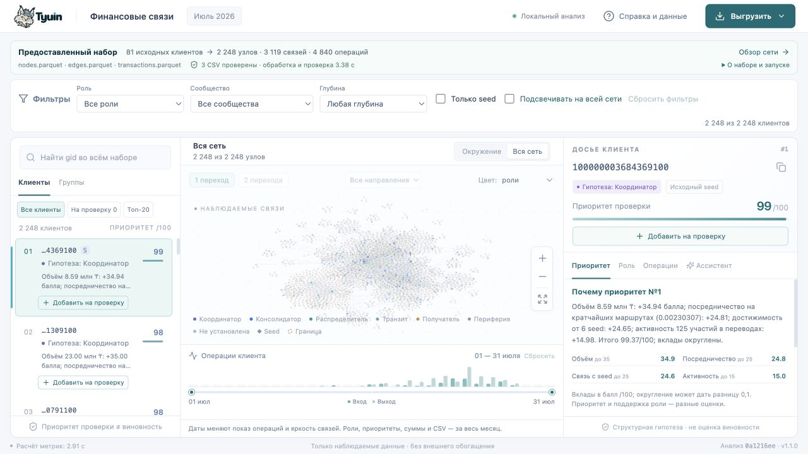
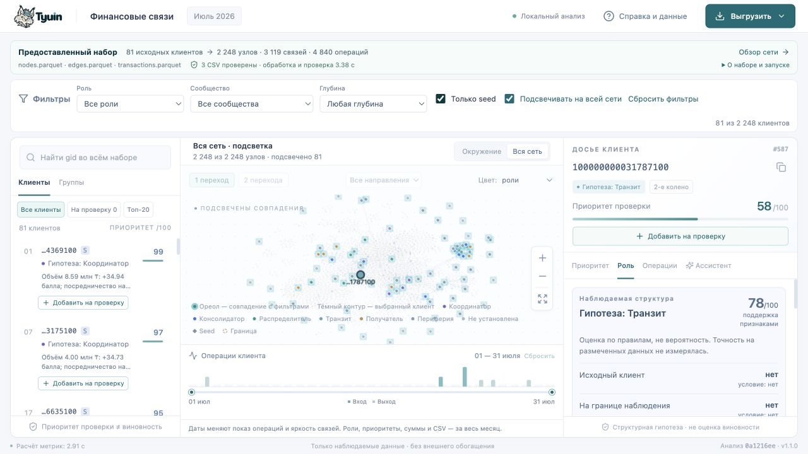

# Подсветка сети и фильтры клиентов · проверка 23.09.2026

Проверенный код: **`db126e522341fb805b865201561f84167c98e535`**, продолжение `feat/finance-demo-scenario` / PR #18 после `30f59c6`. Последующие изменения этой итерации — документация и снимки экрана. Аналитика, API, входные данные и CSV не менялись; алгоритм 1.1.0, `analysis_id=0a1216eed5476f02`. [Предыдущая полная проверка](demo-ux-validation.md) сохранена отдельно.

## Поведение

- Стартуют «Все клиенты» и «Вся сеть». Выбор строки сохраняет текущий режим графа.
- «Подсвечивать на всей сети» оставляет все узлы/связи, выделяет совпадения с фильтрами и приглушает остальные. Отдельный тёмный контур обозначает выбранного клиента. Смена фильтров при включённой подсветке не перестраивает граф и не вызывает fit; счётчик занимает стабильное место, чтобы изменение текста не меняло высоту графа.
- В «Клиенты» фильтры расположены как «Все клиенты» → «На проверку N» → «Топ-20». Они доступны во время поиска; переключение очищает запрос. Top-20 глобальный и совпадает с CSV; его выбор сбрасывает общие фильтры, изменение общего фильтра переключает top-20 на всех клиентов.
- У всех строк общий компонент с глобальным рангом, gid, ролью/seed, приоритетом и основанием. Добавление/удаление из перечня работает в строках и досье. В перечне дополнительно раскрыты полный gid, полное основание и следующий шаг.
- Общие фильтры сужают перечень, но копирование явно включает весь перечень, в том числе скрытых клиентов. После перезагрузки он очищается, как и прежде.
- Сохранён [подробный сценарий](demo.md) с точными действиями и текстом выступления; расположение вкладки «Приоритет» описано для широкого и узкого окна.

## Проверки

Окружение: macOS arm64, Node 25.8.1, установленное окружение проекта. Проверена production-сборка, обслуживаемая локальным Python-сервером.

```bash
cd frontend
npm run format:check
npm test
npm run build
cd ..
git diff --check
```

Prettier, TypeScript и сборка прошли; **8/8 тестов графа прошли**. Дополнены проверки полного графа при подсветке и изменения subset → zero → all → off в headless Cytoscape: топология, координаты, pan/zoom, признаки seed/границы, выбранный узел и ребро сохраняются. Тест изменения оформления не выдаётся за браузерное измерение времени или производительности.

| Браузерный сценарий | Результат |
|---|---|
| Чистое открытие | «Все клиенты», «Вся сеть», 2 248 узлов; top-20 последний; нет отдельной вкладки перечня |
| Подсветка транзита | Все 2 248 узлов сохранены, совпадений 65 |
| Подсветка seed | Все 2 248 узлов сохранены, совпадений 81; выключение галочки оставляет 81 узел |
| Транзит + только seed | Подсветка: вся сеть и 0 совпадений; фильтрация: пустой граф с объяснением |
| Добавление из строк | Первый и второй клиенты добавлены без изменения выбранного досье; в перечне доступны те же ранг/роль/seed/приоритет плюс полный gid, основание и следующий шаг |
| Перечень + только seed | Показан 1 из 2; копирование по кнопке «Скопировать весь перечень (2)» успешно, полный охват явно подписан |
| Поиск из перечня | Глобально найден транзит `100000000031787100`, ограничения списка сброшены; при выключенной подсветке видны 3 узла окружения |
| Возврат из сообщества 03 | Восстановлены перечень из 2 клиентов, фильтр seed, подсветка; снова показан 1 из 2 |
| Восстановление из пустого окружения | Поиск → пустой перечень → локальная кнопка сброса: восстановлены «Все клиенты» и 3 узла окружения выбранного транзита |
| Top-20 | 20 полных gid из UI совпали с `results/top_nodes.csv` по составу и порядку |
| Размеры | Проверены 1280×720 и 390×844. На узком экране ширина документа 385 px при доступных 385 px, горизонтального переполнения нет; панели идут вертикально |

В ходе независимого review найден и исправлен сброс из пустого окружения: он очищал только общие фильтры, оставляя ограничение перечня. Теперь верхняя и локальная кнопки используют полный сброс. Исправление воспроизведено в браузере; последующее review существенных замечаний не выявило.





[Перечень на широком экране](screenshots/demo-review-filter-1280.png) · [Перечень на узком экране](screenshots/demo-review-filter-390.png).

## Границы проверки

Backend и результаты расчёта не изменялись; 45 backend-тестов и замер 4,2752 с относятся к предыдущей проверке того же кода аналитики, здесь они повторно не запускались и новое ускорение не заявляется. Windows/Linux и внешний LLM этой итерацией не проверялись.

Рекомендация: передать обновлённый интерфейс на пользовательскую локальную приёмку. Пятиминутное выступление и минутное объяснение трёх заданных проверяющим gid с человеком ещё не измерены. Merge требует отдельного подтверждения проверенной версии по правилам репозитория.
