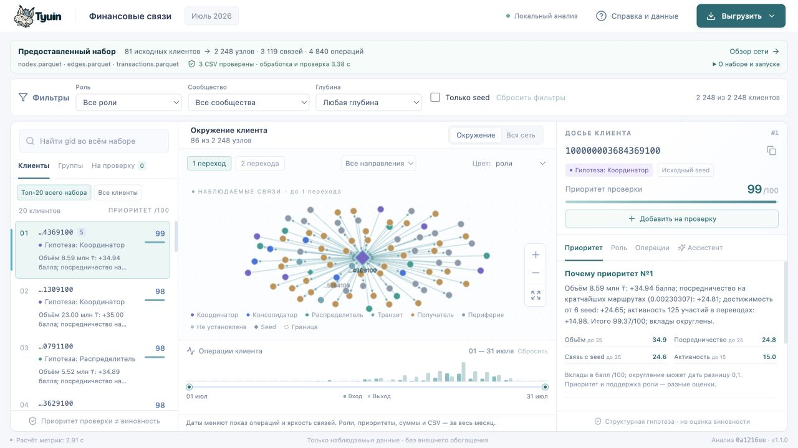
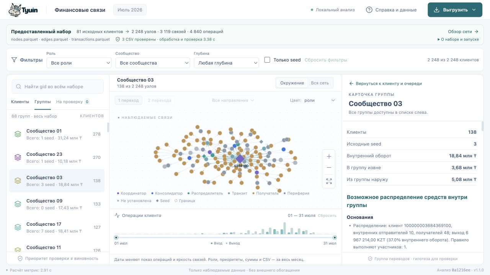

# Проверка сквозного демо, 23.09.2026

Проверенный код: **`22ec2b8a173d28430c2a0e422f957b6d74e72f59`**, ветка `feat/finance-demo-scenario`, база `main` — `0b5e0ba`. После этого commit добавлены документация проверки и снимки интерфейса, затем включена актуальная `main` (`47ade3e`) с конфигурацией Docker/Brev. Конфликты README, индекса документации и бэклога разрешены с сохранением обеих задач. Код приложения и сборка относительно проверенного commit не менялись; конфигурация деплоя сохранена из main без изменений, её прежняя проверка описана отдельно. Алгоритм **1.1.0**, `analysis_id=0a1216eed5476f02`.

Статус: реализация и перечисленные локальные проверки выполнены. Пользовательская приёмка перед merge, пятиминутное выступление команды и объяснение трёх заданных проверяющим gid за минуту **ещё не зафиксированы**. Автоматическая навигация не выдаётся за измерение выступления.

## Объём

- Сводка предоставленного набора с реальным статусом проверки CSV и раздельными интервалами времени.
- Глобальный поиск gid, отдельный top-20, вкладки приоритета и роли, понятные области графа.
- Карточка группы с направленными потоками, гипотезой, численными основаниями, правилами и ограничениями.
- Перечень проверки: выбор нескольких клиентов, возврат к ним, удаление, копирование полных gid/оснований/следующих шагов.
- Все четыре фактора приоритета в `why`, API и локальном пояснении; уточнённый направленный обход графа.

Сохранены формулы ролей и приоритета, Louvain и фиксированные схемы трёх CSV. Самостоятельные задачи о групповых гипотезах и объяснениях приоритета реализованы как зависимости этого сценария; их карточки остаются в работе до требуемой приёмки.

## Окружение и команды

macOS 26.6.2 arm64; Python 3.12.1, Node 25.8.1; Python-зависимости из `requirements.lock`, frontend из `frontend/package-lock.json`. Существующее окружение, установка и Windows/Linux в этой итерации заново не проверялись.

```bash
python -m pytest -q
cd frontend
npm run format:check
npm test
npm run build
cd ..
python scripts/benchmark.py --data data --out out --report out/demo-scenario-benchmark.json
python -m moneygraph demo --data data --out out/demo-browser --port 8897
python -m moneygraph verify --data data --out results
git diff --check
```

| Проверка | Фактический результат |
|---|---|
| Backend | 45 tests passed, 10,37 с. Одно предупреждение Starlette о будущем изменении тестового клиента, ошибок нет |
| Граф | 6 tests passed: вход/выход, два перехода, цикл, скрытый промежуточный узел, контекст соседей, изолят и полная сеть |
| Frontend | Prettier, TypeScript и production build прошли; сборка включена в репозиторий |
| Свежий процесс | 4,2752 с, включая импорты, вычисление, запись и проверку CSV; таймер CLI — 3,2314 с; пиковая память дочернего процесса 312,23 MiB |
| Артефакты | 2 248 узлов, 88 групп, 20 приоритетных клиентов; `verify --out results` — OK |
| Контроль исходников | SHA-256 оригиналов ТЗ/описания совпадают; исходные Parquet не менялись |
| Сравнение с 1.0.0 | `nodes_roles.csv` побайтово идентичен; порядок, роли и оценки top-20, состав/агрегаты групп сохранены; изменены только тексты `why`/`hypothesis` и manifest |

Метод и результат времени сохранены в [новом benchmark](../../results/demo-scenario-benchmark.json). Кэш файлов ОС не очищался; это измерение конкретной машины, не гарантия для всех окружений. Исторические benchmark 1.0.0 сохранены отдельно.

## Браузерный прогон

Проверена production-сборка из локального Python-сервера. Основной размер — 1280×720; дополнительно 390×844. Горизонтального переполнения страницы нет. На мобильном панели идут последовательно, основное демо рассчитано на ноутбук.

| Сценарий | Наблюдение |
|---|---|
| Первый экран | Видны входные файлы, 81 seed, масштаб сети и подтверждение трёх CSV; top-20 содержит ровно 20 строк |
| Фильтр → произвольный поиск | После роли «Получатель» введён изолят `100000000456947100`; клиент найден, фильтры сброшены с сообщением, граф показывает один узел без связей, роль неизвестна, приоритет 0 |
| Граница выгрузки | `100000000018102100`: четвёртое колено, неизвестная роль, вход 7 000 KZT, явное ограничение и запрос следующего колена |
| Разбор группы | Из первого клиента открывается сообщество 03: 138 участников, 3 seed, 18,84 млн KZT внутреннего оборота, гипотеза распределения с основаниями. Все 88 групп остаются в списке |
| Возврат | Возврат из сообщества восстанавливает исходного клиента и очередь; переходы не очищают перечень проверки |
| Дальнее ребро входящей цепочки | Для `100000000031787100` включены входящие цепочки и два перехода; клик по `100000007747786100 → 100000000267734100` открывает получателя, сохраняет ребро и показывает одну операцию 120 000 KZT от 04.07, источник `c30c5317b543:529` |
| Диапазон дат | При ограничении концом 1 июля операций выбранной пары 0, приоритет остаётся 68/100; сброс возвращает операцию. Подпись явно сохраняет месячные оценки/CSV |
| Неизвестный gid | `999999999999999999` возвращает явное сообщение об отсутствии во всём наборе |
| Перечень | Добавлены первый клиент и пограничный; скопированы полные gid, основания и следующие шаги с `analysis_id`; удаление второго оставляет одного; перезагрузка очищает перечень согласно подписи |
| CSV и экран | 20 полных gid из строк интерфейса совпали с порядком `top_nodes.csv`. Три HTTP-экспорта побайтово совпали с файлами серверного снимка и имеют его `X-Analysis-ID`; тексты `why`/`hypothesis` совпадают с API |
| Три произвольных gid | Из полного набора с фиксированным seed выборки 230926 выбраны `100000008583360100`, `100000008782056100`, `100000001279272100`. Все найдены, доступны роли, условия и раскрываемые основания; речь человека не измерялась |





[Мобильный вид](screenshots/demo-scenario-mobile-390.png).

## Проверка предложения и объединённой версии

По протоколу разработки проведены независимые проверки исходного плана, направленного обхода, критериев групп и объединённого кода. Найден и исправлен переход по дальнему ребру входящей цепочки: ранее выбирался отправитель и нужное ребро исчезало из входящего окружения; теперь выбирается получатель. Исправленный переход проверен в браузере с операцией и сохранённым выделением.

Гипотезы групп проверены на синтетических сборе, распределении, смешанной структуре, цепочке/цикле, изоляте, петле, границе и seed; покрыты граничные значения порогов. На предоставленных данных: 41 гипотеза распределения, 4 промежуточного прохождения, 1 смешанная структура, 42 обоснованные неопределённости. Это распределение результатов эвристики, не измерение accuracy. Сообщество 48 остаётся неопределённым по объяснённым признакам.

Рекомендация: **передать версию на локальную приёмку**. Соответствие обязательному пути, реализация, воспроизводимость и понятность результата подтверждены перечисленными проверками; конкурсные баллы не присваивались. Следующий шаг — пройти [демо](demo.md) и отдельное минутное упражнение с человеком, затем подтвердить приёмку конкретной версии перед merge.

## Ограничения

- Критерии групп — документированные начальные эвристики; размеченной оценки нет. Сумма min месячных входа/выхода не означает уникальные средства и может учитывать одну цепочку у нескольких участников.
- Перечень проверки живёт в текущем открытом анализе; постоянное хранение после перезагрузки отложено, копирование доступно.
- Свободный AI-чат, новые роли, загрузка собственных наборов и масштабирование на миллион узлов не входят в эту итерацию.
- Живой внешний LLM API не вызывался; обязательный сценарий работает без него. Проверка статуса и отказов проводится backend-тестами.
- Пятиминутное выступление, минутное объяснение трёх gid и пользовательская локальная приёмка остаются обязательными отдельными действиями; этот отчёт их не заменяет.
